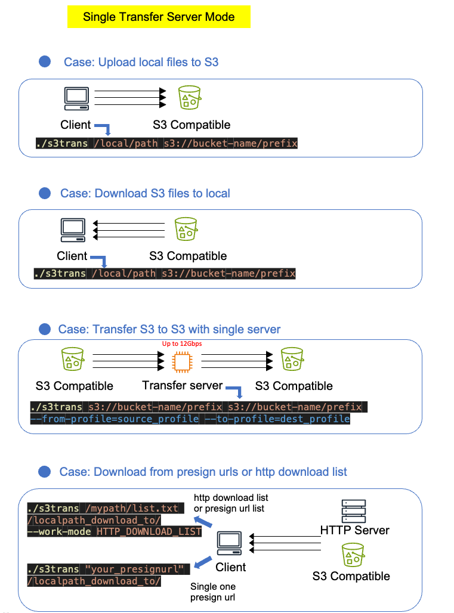
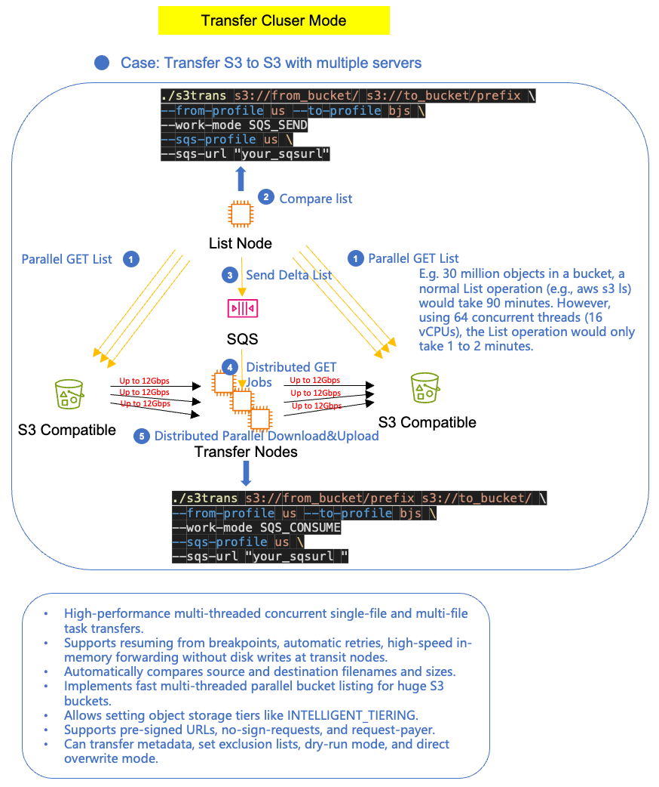

# Amazon S3 Resumable Transfer V2  (Amazon S3 断点续传传输 V2)

中文 README: [README.md](README.md)
  
Multi-threaded breakpoint resumption, suitable for batch uploading/downloading large files to/from S3 and local/cross-object storage migration. It supports Amazon S3, Alibaba Cloud OSS, Tencent Cloud COS, Google Cloud Storage, Huawei Cloud OBS, and other object storage services compatible with the S3 API. In Version 2, the same application can be configured for various scenarios through configuration: single-machine uploading, single-machine downloading, deployed as a cluster version for scanning source files, or as a distributed transmission worker node in a cluster. It has been refactored with Go for improved performance and supports a range of extended features: exclusion list, source no-sign-request, source request-payer, destination storage-class, destination ACL, and metadata transfer.




## Features

* Supports multi-threaded concurrent transfers to multiple object storage systems, with resumable transfers, automatic retries, and concurrent multi-file tasks to fully utilize bandwidth. An optimized flow control mechanism is implemented. In a cluster test (10*m5.large instances), 1.2TB of data was migrated from us-east-1 to cn-northwest-1 in just 1 hour. In another single-machine bandwidth test, using an m6i.8xlarge EC2 instance (num-workers 16), a sustained transfer speed of 12Gbps was achieved between two S3 buckets in the same region.

* Supports sources and destinations including local directories or files, Amazon S3, Alibaba OSS, Tencent COS, Google GCS, and other object storage systems. No need to distinguish between work modes; simply specify the source and destination URLs or local paths, and the transfer will automatically start. Can handle single files or objects, entire directories, S3 buckets/prefixes, etc.

* Data is transferred through intermediate nodes in single chunk form without being written to disk, saving time and improving security. Supports transfers from 0 bytes up to TB-level sizes.

* Allows setting various object storage classes for the destination, such as STANDARD|REDUCED_REDUNDANCY|STANDARD_IA|ONEZONE_IA|INTELLIGENT_TIERING|GLACIER|DEEP_ARCHIVE|OUTPOSTS|GLACIER_IR|SNOW

* Supports specifying the destination S3 ACL: private|public-read|public-read-write|authenticated-read|aws-exec-read|bucket-owner-read|bucket-owner-full-control

* Supports setting the source object storage as no-sign-request and request-payer.

* Supports source objects as Presigned URLs or URL lists (please ensure the correct Region is specified when generating Presigned URLs).

* Supports retrieving and copying metadata from the source object storage to the destination.

* Automatically compares file names and sizes between source and destination buckets, transferring only mismatched files. By default, it lists and transfers simultaneously, fetching destination object information and transferring one by one, providing an immediate transfer start after entering the command (similar to AWS CLI). Optionally, the -l parameter can be used to list all destination objects before transferring, which is more efficient and reduces request costs.

* Version 2 now supports multi-threaded parallel listing, significantly speeding up the listing process for buckets with large numbers of objects. For example, a bucket with 30 million objects that would normally take over 90 minutes to list (e.g., with aws s3 ls) can now be listed in just 1-2 minutes using 64 concurrent threads (16 vCPU).

* Supports saving the compared task list to a file, saving logs of tasks sent to SQS to a file, setting an exclusion list to skip transferring keys or local paths matching the list, a DRYRUN mode to compare sources and destinations without transferring data, and a mode to overwrite destinations without comparison.

* Supports setting a resumable transfer threshold, parallel thread count, request timeout, maximum retry count, and an option to ignore confirmation prompts and execute directly.

## Usage

### Install Go Runtime  

For first time use, install Golang runtime, example for Linux:

```shell
sudo yum install -y go git -y
git clone https://github.com/aws-samples/amazon-s3-resumable-upload
```

For China regions, use go proxy to speed up downloading go packages, add:  

```go
go env -w GOPROXY=https://goproxy.cn,direct   
```

### Compile Go Code

```shell
cd amazon-s3-resumable-upload
go build .  # downloads dependencies and compiles
```

Use ./s3trans -h to see help

### Quick Start

* Download S3 file to local:

```shell
./s3trans s3://bucket-name/prefix /local/path
# Above uses default AWS profile in ~/.aws/credentials, or IAM Role if on EC2. To specify profile for source S3:  
./s3trans s3://bucket-name/prefix /local/path --from_profile=source_profile
```

* Upload local file to S3:

```shell
./s3trans /local/path s3://bucket-name/prefix 
# Above uses default AWS profile in ~/.aws/credentials, or IAM Role if on EC2. To specify profile for destination S3:
./s3trans /local/path s3://bucket-name/prefix --to_profile=dest_profile 
```

* S3 to S3, region is auto detected if not specified:

```shell
./s3trans s3://bucket-name/prefix s3://bucket-name/prefix --to_profile=dest_profile
# Above from_profile not set uses default or EC2 IAM Role. Can also specify both:
./s3trans s3://bucket-name/prefix s3://bucket-name/prefix --from_profile=source_profile --to_profile=dest_profile 
```

* For non-AWS S3 compatible storage, specify endpoint:

```shell
./s3trans s3://bucket-gcs-test s3://bucket-virginia --from_profile=gcs_profile --to_profile=aws_profile --from_endpoint=https://storage.googleapis.com
# Can use short names for endpoints, e.g. --from_endpoint=google_gcs, also supports: ali_oss, tencent_cos, azure_blob(TODO: azure)
```

* -l to list target before transfer (less API calls but slower start)
* -n (n is NumWorkers) to specify concurrency for listing and transfers. Max concurrent objects is n, max concurrent parts per object is 4n, max concurrent listing is 4n. Recommend n <= vCPU number  
* -y to auto confirm prompt

```shell
./s3trans C:\Users\Administrator\Downloads\test\ s3://huangzb-virginia/win2/ --to-profile sin  -l -n 8 -y 
```

## Download from Presign URL or URL list

Download a single presigned URL (presigned URL) concurrently:

```shell
./s3trans "https://your_bucket.s3.region.amazonaws.com/prefix/filename?X-Amz-Algorithm=xxxx&&X-Amz-Credential=xxxx&&X-Amz-Date=xxxx&&X-Amz-Expires=xxxx&X-Amz-SignedHeaders=host&X-Amz-Signature=xxxx" /localpath_download_to/
```

Download from a list of URLs. In the example below, the URL list file is named list_file.txt, with each line containing a presigned URL:

```shell
./s3trans /mypath/list_file.txt /localpath_download_to/
    --work-mode HTTP_DOWNLOAD_LIST
```

## More usage help

```shell
./s3trans -h

s3trans transfers data from source to target.
    ./s3trans FROM_URL TO_URL [OPTIONS]
    FROM_URL: The url of data source, e.g. /home/user/data or s3://bucket/prefix
    TO_URL: The url of data transfer target, e.g. /home/user/data or s3://bucket/prefix
    For example:
    ./s3trans s3://bucket/prefix s3://bucket/prefix -from_profile sin -to_profile bjs
    ./s3trans s3://bucket/prefix /home/user/data -from_profile sin

Usage:
  s3trans FROM_URL TO_URL [flags]

Flags:
      --acl string                The TARGET S3 bucket ACL, private means only the object owner can read&write, e.g. private|public-read|public-read-write|authenticated-read|aws-exec-read|bucket-owner-read|bucket-owner-full-control
      --from-endpoint string      The endpoint of data source, e.g. https://storage.googleapis.com; https://oss-<region>.aliyuncs.com; https://cos.<region>.myqcloud.com . If AWS s3 or local path, no need to specify this.
      --from-profile string       The AWS profile in ~/.aws/credentials of data source
      --force-path-style          Set this to true to force the request to use path-style addressing See http://docs.aws.amazon.com/AmazonS3/latest/dev/VirtualHosting.html
      --from-region string        The region of data transfer source, e.g. cn-north-1. If no specified, the region will be auto detected with the credentials you provided in profile.
  -h, --help                      help for s3trans
      --http-timeout int          API request timeout (seconds) (default 30)
  -l, --list-target               List the TARGET S3 bucket, compare exist objects BEFORE transfer. List is more efficient than head each object to check if it exists, but transfer may start slower because it needs to wait for listing all objects to compare. To mitigate this, this app leverage Concurrency Listing for fast list; If no list-target para, transfer without listing the target S3 bucket, but before transfering each object, head each target object to check, this costs more API call, but start faster.
      --max-retries int           API request max retries (default 5)
      --no-sign-request           The SOURCE bucket is not needed to sign the request
  -n, --num-workers int           NumWorkers*1 for concurrency files; NumWorkers*4 for parts of each file and for listing target bucket; Recommend NumWorkers <= vCPU number (default 4)
      --request-payer             The SOURCE bucket requires requester to pay, set this
      --resumable-threshold int   When the file size (MB) is larger than this value, the file will be resumable transfered. (default 50)
  -s, --skip-compare              If True, skip to compare the name and size between source and target S3 object. Just overwrite all objects. No list target nor head target object to check if it already exists.
      --sqs-profile string        The SQS queue leverage which AWS profile in ~/.aws/credentials
      --sqs-url string            The SQS queue URL to send or consume message from, e.g. https://sqs.us-east-1.amazonaws.com/my_account/my_queue_name
      --storage-class string      The TARGET S3 bucket storage class, e.g. STANDARD|REDUCED_REDUNDANCY|STANDARD_IA|ONEZONE_IA|INTELLIGENT_TIERING|GLACIER|DEEP_ARCHIVE|OUTPOSTS|GLACIER_IR|SNOW or others of S3 compatibale
      --to-endpoint string        The endpoint of data transfer target, e.g. https://storage.googleapis.com . If AWS s3 or local path, no need to specify this.
      --to-profile string         The AWS profile in ~/.aws/credentials of data transfer target
      --to-region string          The region of data transfer target, e.g. us-east-1. If no specified, the region will be auto detected with the credentials you provided in profile.
      --transfer-metadata         If True, get metadata from source S3 bucket and upload the metadata to target object. This costs more API calls.
      --work-mode string          SQS_SEND | SQS_CONSUME | DRYRUN | HTTP_DOWNLOAD_LIST; SQS_SEND means listing source FROM_URL S3 and target TO_URL S3 to compare and send message to SQS queue, SQS_CONSUME means consume message from SQS queue and transfer objects from FROM_URL S3 to TO_URL S3; DRYRUN means only count the objects and sizes comparing delta list of FROM_URL S3 and TO_URL S3, no transfer; HTTP_DOWNLOAD_LIST, from a list file with lines of presign url
  -y, --y                         Ignore waiting for confirming command
```

## License
  
This library is licensed under the MIT-0 License. See the LICENSE file.
  
  ******
  Author: Huang, Zhuobin (James)
  ******
  