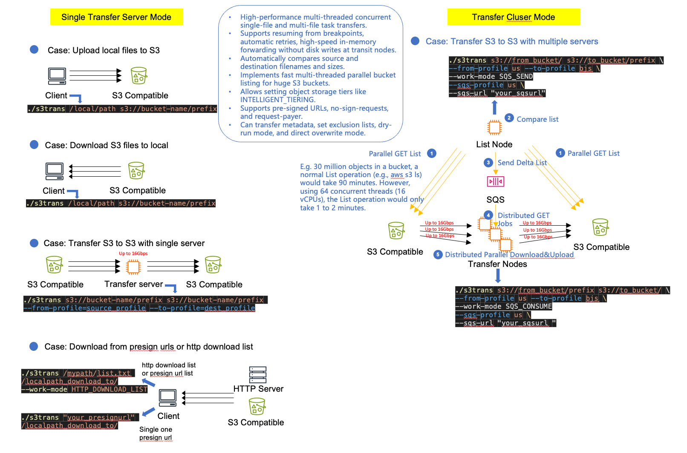

# Amazon S3 Resumable Migration Version 2  (Amazon S3 断点续传迁移 Version 2)

中文 README: [README.md](README.md)
  
Multi-threaded resumable upload, fully utilize bandwidth, suitable for bulk large file S3 upload/migration, support Amazon S3, Ali OSS, Tencent COS, Google GCS, HuaweiCloud and other S3 API object storage.  
The main change in Version 2 is that the same application can be used for single machine upload, single machine download, deployed as a cluster for scanning source files, or as worker nodes for transfers, rewritten in Golang for better performance.



## Features

* Multi-threaded concurrent transfers to multiple object storage, resumable upload, auto retry on failure. Concurrent transfers of multiple files, fully utilize bandwidth. Optimized flow control. In typical tests, migrating 1.2TB data from us-east-1 S3 to cn-northwest-1 S3 only takes 1 hour.  

* Supported sources and destinations: local directory/file, Amazon S3, Ali OSS, Tencent COS, Google GCS and other object storage. No need to differentiate work modes, just specify source and destination URLs or local paths and it will automatically detect. Can be a single file/object, entire directory, S3 bucket/prefix, etc.

* Data is transferred via memory in single shard form through transit nodes, not saved on local disk, saving time, storage and more secure. Support sizes from 0 Bytes to TBs.

* Automatically compare filenames and sizes between source and destination buckets, only transfer inconsistencies. Default is to list and transfer concurrently, i.e. get destination object info one by one and transfer if not exists, so transfer starts immediately after command like AWS CLI. Use -l option to list all destination objects first before transferring, list is more efficient than head each, also saves API call costs. Version 2 supports parallel listing, for buckets with large number of objects, listing is much faster, e.g. 30 million objects bucket normally takes 90 mins to list, now only takes 1 min with 64 concurrency (16 vCPU).  

* Support setting various storage classes for destination objects, e.g. STANDARD, S3-IA, Glacier or Deep Archive. Support specifying ACL for destination S3.

* Support setting the source object storage to no-sign-request and request-payer  

* Support the source object being a Presigned URL or URL list (note that when generating the Presigned URL, specify the correct Region for the Bucket).  

* Support copying metadata from source to destination S3 objects. Note this requires a Head call per object, impacting performance and API call costs.

## Usage

### Install Go Runtime  

For first time use, install Golang runtime, example for Linux:

```shell
sudo yum install -y go git -y
git clone https://github.com/aws-samples/amazon-s3-resumable-upload
```

For China regions, use go proxy to speed up downloading go packages, add:  

```go
go env -w GOPROXY=https://goproxy.cn,direct   
```

### Compile Go Code

```shell
cd amazon-s3-resumable-upload
go build .  # downloads dependencies and compiles
```

Use ./s3trans -h to see help

### Quick Start

* Download S3 file to local:

```shell
./s3trans s3://bucket-name/prefix /local/path
# Above uses default AWS profile in ~/.aws/credentials, or IAM Role if on EC2. To specify profile for source S3:  
./s3trans s3://bucket-name/prefix /local/path --from_profile=source_profile
```

* Upload local file to S3:

```shell
./s3trans /local/path s3://bucket-name/prefix 
# Above uses default AWS profile in ~/.aws/credentials, or IAM Role if on EC2. To specify profile for destination S3:
./s3trans /local/path s3://bucket-name/prefix --to_profile=dest_profile 
```

* S3 to S3, region is auto detected if not specified:

```shell
./s3trans s3://bucket-name/prefix s3://bucket-name/prefix --to_profile=dest_profile
# Above from_profile not set uses default or EC2 IAM Role. Can also specify both:
./s3trans s3://bucket-name/prefix s3://bucket-name/prefix --from_profile=source_profile --to_profile=dest_profile 
```

* For non-AWS S3 compatible storage, specify endpoint:

```shell
./s3trans s3://bucket-gcs-test s3://bucket-virginia --from_profile=gcs_profile --to_profile=aws_profile --from_endpoint=https://storage.googleapis.com
# Can use short names for endpoints, e.g. --from_endpoint=google_gcs, also supports: ali_oss, tencent_cos, azure_blob(TODO: azure)
```

* -l to list target before transfer (less API calls but slower start)
* -n (n is NumWorkers) to specify concurrency for listing and transfers. Max concurrent objects is n, max concurrent parts per object is 4n, max concurrent listing is 4n. Recommend n <= vCPU number  
* -y to auto confirm prompt

```shell
./s3trans C:\Users\Administrator\Downloads\test\ s3://huangzb-virginia/win2/ --to-profile sin  -l -n 8 -y 
```

## Download from Presign URL or URL list

Download a single presigned URL (presigned URL) concurrently:

```shell
./s3trans "https://your_bucket.s3.region.amazonaws.com/prefix/filename?X-Amz-Algorithm=xxxx&&X-Amz-Credential=xxxx&&X-Amz-Date=xxxx&&X-Amz-Expires=xxxx&X-Amz-SignedHeaders=host&X-Amz-Signature=xxxx" /localpath_download_to/
```

Download from a list of URLs. In the example below, the URL list file is named list_file.txt, with each line containing a presigned URL:

```shell
./s3trans /mypath/list_file.txt /localpath_download_to/
    --work-mode HTTP_DOWNLOAD_LIST
```

## More usage help

```shell
./s3trans -h

s3trans transfers data from source to target.
    ./s3trans FROM_URL TO_URL [OPTIONS]
    FROM_URL: The url of data source, e.g. /home/user/data or s3://bucket/prefix
    TO_URL: The url of data transfer target, e.g. /home/user/data or s3://bucket/prefix
    For example:
    ./s3trans s3://bucket/prefix s3://bucket/prefix -from_profile sin -to_profile bjs
    ./s3trans s3://bucket/prefix /home/user/data -from_profile sin

Usage:
  s3trans FROM_URL TO_URL [flags]

Flags:
      --acl string                The TARGET S3 bucket ACL, private means only the object owner can read&write, e.g. private|public-read|public-read-write|authenticated-read|aws-exec-read|bucket-owner-read|bucket-owner-full-control
      --from-endpoint string      The endpoint of data source, e.g. https://storage.googleapis.com; https://oss-<region>.aliyuncs.com; https://cos.<region>.myqcloud.com . If AWS s3 or local path, no need to specify this.
      --from-profile string       The AWS profile in ~/.aws/credentials of data source
      --force-path-style          Set this to true to force the request to use path-style addressing See http://docs.aws.amazon.com/AmazonS3/latest/dev/VirtualHosting.html
      --from-region string        The region of data transfer source, e.g. cn-north-1. If no specified, the region will be auto detected with the credentials you provided in profile.
  -h, --help                      help for s3trans
      --http-timeout int          API request timeout (seconds) (default 30)
  -l, --list-target               List the TARGET S3 bucket, compare exist objects BEFORE transfer. List is more efficient than head each object to check if it exists, but transfer may start slower because it needs to wait for listing all objects to compare. To mitigate this, this app leverage Concurrency Listing for fast list; If no list-target para, transfer without listing the target S3 bucket, but before transfering each object, head each target object to check, this costs more API call, but start faster.
      --max-retries int           API request max retries (default 5)
      --no-sign-request           The SOURCE bucket is not needed to sign the request
  -n, --num-workers int           NumWorkers*1 for concurrency files; NumWorkers*4 for parts of each file and for listing target bucket; Recommend NumWorkers <= vCPU number (default 4)
      --request-payer             The SOURCE bucket requires requester to pay, set this
      --resumable-threshold int   When the file size (MB) is larger than this value, the file will be resumable transfered. (default 50)
  -s, --skip-compare              If True, skip to compare the name and size between source and target S3 object. Just overwrite all objects. No list target nor head target object to check if it already exists.
      --sqs-profile string        The SQS queue leverage which AWS profile in ~/.aws/credentials
      --sqs-url string            The SQS queue URL to send or consume message from, e.g. https://sqs.us-east-1.amazonaws.com/my_account/my_queue_name
      --storage-class string      The TARGET S3 bucket storage class, e.g. STANDARD|REDUCED_REDUNDANCY|STANDARD_IA|ONEZONE_IA|INTELLIGENT_TIERING|GLACIER|DEEP_ARCHIVE|OUTPOSTS|GLACIER_IR|SNOW or others of S3 compatibale
      --to-endpoint string        The endpoint of data transfer target, e.g. https://storage.googleapis.com . If AWS s3 or local path, no need to specify this.
      --to-profile string         The AWS profile in ~/.aws/credentials of data transfer target
      --to-region string          The region of data transfer target, e.g. us-east-1. If no specified, the region will be auto detected with the credentials you provided in profile.
      --transfer-metadata         If True, get metadata from source S3 bucket and upload the metadata to target object. This costs more API calls.
      --work-mode string          SQS_SEND | SQS_CONSUME | DRYRUN | HTTP_DOWNLOAD_LIST; SQS_SEND means listing source FROM_URL S3 and target TO_URL S3 to compare and send message to SQS queue, SQS_CONSUME means consume message from SQS queue and transfer objects from FROM_URL S3 to TO_URL S3; DRYRUN means only count the objects and sizes comparing delta list of FROM_URL S3 and TO_URL S3, no transfer; HTTP_DOWNLOAD_LIST, from a list file with lines of presign url
  -y, --y                         Ignore waiting for confirming command
```

## License
  
This library is licensed under the MIT-0 License. See the LICENSE file.
  
  ******
  Author: Huang, Zhuobin (James)
  ******
  