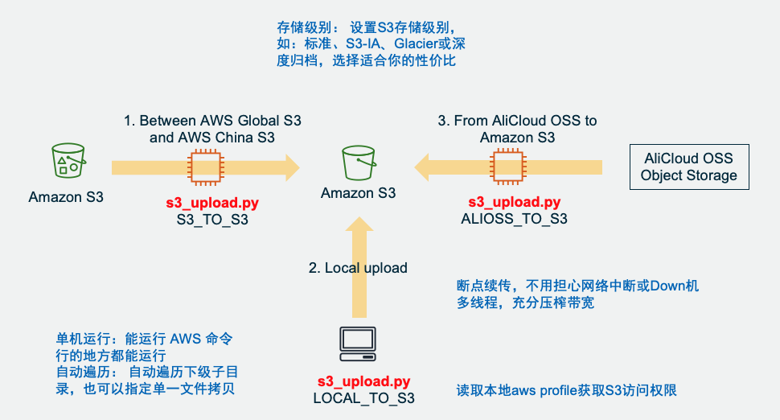
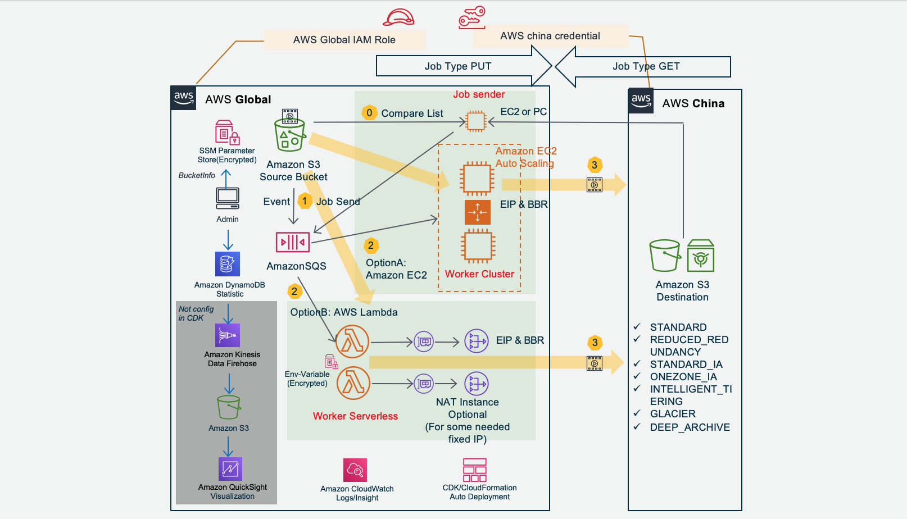

# Amazon S3 MultiThread Resume Migration Solution  (Amazon S3多线程断点续传迁移)   

Breaking-point resume supported, suitable for mass files transimission to Amazon S3  
多线程断点续传，充分利用带宽，适合批量的大文件迁移到S3。  

Upload from local server, migrate files between Global and China Amazon S3, or migrate from AliCloud OSS to Amazon S3. Now support Single Node Version, Cluster Version and Serverless AWS Lambda Version.  
从本地服务器上传，或海外与中国区 Amazon S3 之间互相拷贝，或从阿里云 OSS 迁移到 Amazon S3。现已支持单机版，多台服务器的集群版和无服务器 AWS Lambda 版本。  
  
## Features 功能：  

* Multi-threads transmission to Amazon S3, support resuming upload, auto retry, fully usage bandwidth. Optimized traffic control mechanism. A typical test result is migrate 1.2TBytes data from us-east-1 S3 to cn-northwest-1 S3 in ONE HOUR.  
多线程并发传输到目的 Amazon S3，断点续传，自动重传。多文件任务并发，充分利用带宽。优化的流控机制。在典型测试中，迁移1.2TB数据从 us-east-1 S3 到 cn-northwest-1 S3 只用1小时。

* Support sources:
Single node version: local folder/file, Amazon S3, AliCloud OSS  
Cluster and Serverless version: Amazon S3  
单机版支持的源：本地目录/文件、Amazon S3、阿里云 OSS  
集群与Serverless版支持源：Amazon S3  

* Support destination: Amazon S3  
支持的目的地：Amazon S3  

* In S3_TO_S3 or ALIOSS_TO_S3 mode, the data is only transimitted through memory of the middle node by single part, not saving to local disk of the node, for high performance, no storage needed and better security. This project can support data from 0 Size to TBytes level.  
S3_TO_S3 或 ALIOSS_TO_S3 模式下，传输数据只以单个分片的形式过中转节点的内存，不落该节点本地盘，节省时间、存储并且数据更安全。可支撑 0 Size 至 TB 级别。  

* Support setup all S3 storage class, such as: standard, S3-IA, Glacier or Deep Archive  
支持设置所有S3存储级别，如：标准、S3-IA、Glacier或深度归档。  

## Module Selection - 版本选择  

### Single Node - 单机版  
Single Python file can run anywhere - 单个 Python 文件可在任何地方运行  
* LOCAL_TO_S3: - 本地上传   
* S3_TO_S3: In one batch - 轻中量级，一次性运行的   
* ALIOSS_TO_S3: - 阿里云OSS到S3  
### Serverless - 无服务器版:  
AWS Lambda + Amazon SQS  
* S3_TO_S3: Unpredictable transimission tasks, or instantly sync data. Light weight to mid-weight ( Recommanded Single file < 50GB ). Leverage break-point resuming and SQS redrive, no worry of Lambda 15 minutes timeout. 
轻中量(建议单文件< 50GB)，不定期传输，或即时数据同步。利用断点续传和SQS重驱动，Lambda不用担心15分钟超时。  
### Cluster - 集群版:  
Amazon EC2 Autoscaling + Amazon SQS 
* S3_TO_S3: Mass of files with single size from 0 to TByte. Cron scan tasks or instantly sync data ( S3 trigger SQS ).  
大量文件，单文件从0到TB级别。定时任务扫描或即时数据同步（S3触发SQS）。  
### Jobsender - 任务调度:  
* Scan S3 exist objects, create delta job list to trigger SQS. Can work with Cluster or Serverless. The code is in the folder of Cluster. The Cluster CDK will deploy Jobsender Server. The Serverless CDK has not deploy this, you can manually deploy if needed.  
扫描S3现有文件，生成差异列表发任务到SQS。可以与Cluster或Serverless一起工作。代码在Cluster目录下，Cluster 的 CDK 会自动部署 Jobsender 服务器，Serverless 的 CDK 暂时没做这个部署，如果需要可以手工部署。  

## Description - 说明
### Single Node Module Detail - 单机版  
* Single node: It can run on anywhere with Python. Even no Python environment, you can use package version.  
单机运行：能运行 Python 的地方都能运行，无 Python 环境也可使用打包版本。  
* Auto traversal: Auto traversal sub-directory, can also specify to just one file copying  
自动遍历： 自动遍历下级子目录，也可以指定单一文件拷贝  
* Break-point resume upload, no worry of network breaken or server crash.  
断点续传，不用担心网络中断或Down机  
* Multiple thread concurrently transmission, fully usage of bandwidth.  
多线程，充分压榨带宽  
  
  [Single Node Module -- -- 进入单机版](./single_node/)  
    
  Single node Module architecture - 单机版架构图如下：  
  

  
  
### Cluster and Serverless Module Detail - 集群与无服务器版本  
Amazon EC2 Autoscaling Group Cluster and Serverless AWS Lambda can be deployed together, or seperated used in different senario  
Amazon EC2 自动扩展集群版本和无服务器 AWS Lambda版本，可以分别单独部署和运行在不同场景，也可以一起运行。  
* Transmission between AWS Global and AWS China: Cluster version is suitable for mass data migration. Serverless version is suitable for unschedule burst migration.  
海外和国内Amazon S3互传：集群版适用于海量文件传输，无服务器版适合不定期突发传输。  
* Fast and stable: Multiple nodes X Multiple files/node X Multiple threads/file. Support mass of hugh file concurrently migration. TCP BBR is enable for cluster to accelerating.  
快速且稳定：多节点 X 单节点多文件 X 单文件多线程，支撑海量巨型文件并发传输。启用BBR加速。  
* Reliability: Amazon SQS queue managed files level jobs, break-point resume trasmission, with timeout protection. Every part will be verified with MD5 after transmission. Single Point of True, final file merging takes the destination Amazon S3 as standard, to ensure integrity.  
可靠：Amazon SQS消息队列管理文件级任务，断点续传，超时中断保护。每个分片MD5完整性校验。Single Point of True，最终文件合并以Amazon S3上的分片为准，确保分片一致。  
* Security: Transfer in memory, no writing to disk. SSL encryption on transmission. Open source for audit. Leverage IAM role and ParameterStore(KMS) to store credential Access Key.  
安全：内存转发不写盘，传输SSL加密，开源代码可审计，采用IAM Role和利用 ParameterStore 加密存储密钥 AcceesKey。  
* Controlable operation: Job dispatched match the speed of transmission. System capacity predictable. Amazon DynamoDB and SQS read/write frequency only related to file numbers, no related to file size. Auto-collect logs to CloudWatch log group. AWS CDK auto deploy.   
可控运营：任务派发与传输速度相匹配，系统容量可控可预期；Amazon DynamoDB和SQS读写次数只与文件数相关，而与文件大小基本无关；日志自动收集；AWS CDK自动部署；  
* Elastic cost optimization: Cluster auto scale up and down, combining with Amazon EC2 spot to save cost. Serverless AWS Lambda only pay for invocation. Support all kind of Amazon S3 Storage Class, save long term storage cost.  
弹性成本优化：集群自动扩展，结合Amazon EC2 Spot节省成本；无服务器 AWS Lambda只按调用次数计费；支持直接存入 Amazon S3 各种存储级别，节省长期存储成本。  
* Serverless solution with AWS Lambda can also support large file of tens of GBytes size with Amazon SQS Redrive, no worry of 15 mins timeout of AWS Lambda.  
基于 Amazon SQS Redrive，无服务器 AWS Lambda 也可以支持GB级别的大文件传输，无需担心 Lambda 15分钟超时。  
  
  [Cluster Module (English Readme)](./cluster/README-English.md) -- -- [进入集群版(中文说明)](./cluster/)  
  [Serverless Module (English Readme)](./serverless/README-English.md) -- -- [进入无服务器版(中文说明)](./serverless/)  
      
  Cluster&Serverless Module Architeture - 集群和无服务器版架构图如下：  
  
  
  
## License

This library is licensed under the MIT-0 License. See the LICENSE file.
