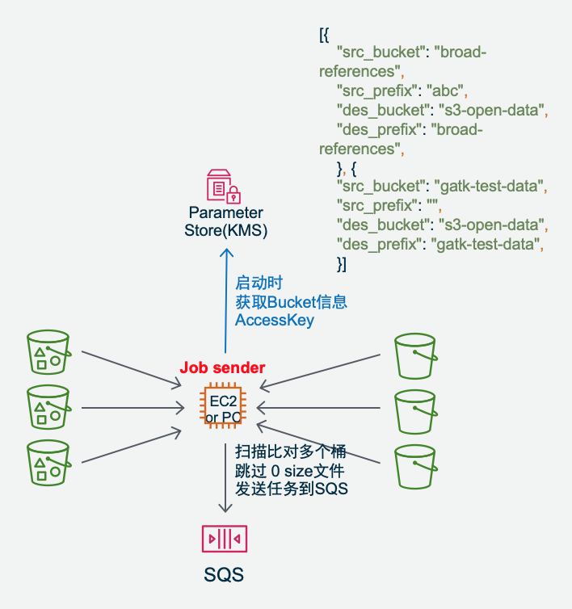
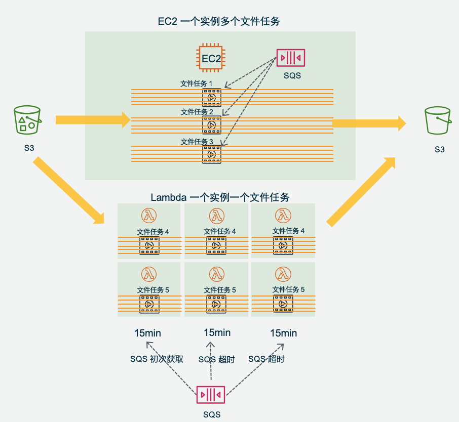
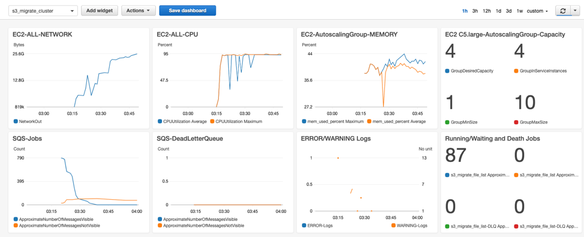
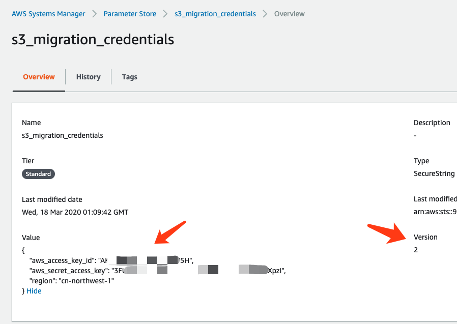
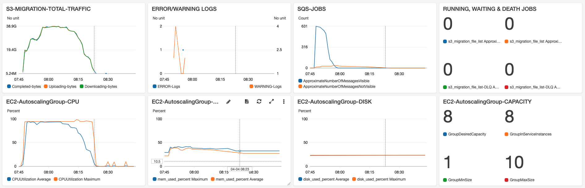

# Amazon S3 MultiThread Resume Migration Cluster Solution   

  PROJECT LONGBOW  -  Amazon EC2 Autoscaling Cluster. Support mass scale of large objects trasmission between AWS Global Amazon S3 and China Amazon S3   
Cluster & Serverless Version 0.95  

  Cluster and Serverless Version Architecture:  
  
  
  
## Highlight 
* Transmit between Global and China Amazon S3: Cluster Version suitable of mass scale transmission, Serverless Version suitable for unpredictable burst transmission  
* **Fast and stable**: Multiple nodes X Multiple files/node X Multiple threads/file. Support mass of hugh file concurrently migration. Auto-seperate small file ( including 0 Size) and large file for different procedure. Enable TCP BBR acceleration.   
* **Reliability**: Amazon SQS queue managed files level jobs, break-point resume trasmission, with timeout protection. Every part will be verified with MD5 after transmission. Single Point of True, final file merging takes the destination Amazon S3 as standard, to ensure integrity.  
* **Security**: Transfer in memory, no writing to disk. SSL encryption on transmission. Open source for audit. Leverage IAM role and SSM ParameterStore(KMS) to store credential Access Key.   
* **Controlable operation**: Job dispatched match the speed of transmission. System capacity predictable. DynamoDB and SQS read/write frequency only related to file numbers, no related to file size. Auto-collect logs to CloudWatch log group. AWS CDK auto deploy whole solution including Dashboard.  
* **Elastic cost optimization**: Cluster Autoscaling combined with EC2 Sport Instance to save cost. Serverless Lambda only pay to invocation; Support put objects to all kind of Amazon S3 storage class, to save long term storage cost.  
* Cluster version can work together with AWS Lambda Serverless version, to support hybrid mode of traffic.  
  
## Guideline  
### Procedure  
0. Preparation(Optional): Jobsender fetch source and destination bucket list and compare delta to a Job List. And it can be run regularly.  

1. Jobsender sends Job messages to Amazon SQS, each job message on Amazon SQS is one file object on Amazon S3. And record job status on Amazon DynamoDB for statistic.  
Amazon S3 Object created can also trigger Amazon SQS directly.  

2. Amazon EC2 or/and AWS Lambda get Job message from SQS. Each EC2 instance can get multiple Job concurrently. 

3. Amazon EC2 or/and AWS Lambda create multiple threads for each job, each thread transmit different part of the file object and upload to destination S3.

* Amazon EC2 and AWS Lambda can work seperately and can work together to get different SQS Job, but notice the SQS timeout setting  

### 4 ways to start
* Job Sender get List from multiple Amazon S3 bucket and compare to destination

* New object created on Amazon S3 and trigger Amazon SQS message

* Bach jobs completed and start Job Sender to List compare buckets again.

* Cron event to trigger Job Sender to List bucket, compare and send new jobs.  

4 ways to start. Diagram:  
  

### Performance and Controlable operation  
  
* Single worker node concurrently multi-threads to get jobs from Amazon SQS, each job is one file level object on Amazon S3, and each job will be got by only one worker. Worker init multi-threads to concurrently transimit one job. This makes it high performance and controlable on file level, as well as one big file will not stuck all threads, suitable for large scale of big files.  
* Server enabled TCP BBR acceleration, its performance accelerates 2.5 times than default Cubic mode  
* Multiple Amazon EC2 working together, performace overlay.  
* Recommanded to deploy Amazon EC2 cluster to the same region as source S3 and enable VPC S3 Endpoint  
* Record working status on DynamoDB for statistic. Transmit one file only need to write DynamoDB for 2-4 times.  
* Source/Destination bucket/prefix setting managed centrally on AWS SSM ParaStore, no need to login to Amazon EC2 server for setting.  

### Performance testing
For large scale of GBytes level of files, single node c5.large ( Setting 5 Files X 30 Threads in this test) can reach 800Mbps between Global and China Amazon S3. If they are most MBytes level files, you can setup more concurrency for one Amazon EC2 node.  
  
As above graph, Autoscaling Group adding more EC2, and more traffic handling adding up in line rate, 9 EC2 up to 900+MB/s (7.2Gbps).  
Transfer 1.2TBytes (916 Files), takes only one hour, from us-east-1 to cn-northwest-1. After jobs all finished, it auto shutdown EC2s and keep only one left.  

Test files size distribution as below:   

* 100MB File 13 sec   
* 1GB File 53 sec  
* 5GB File 215 sec  
* 40GB File 35.8 min  

### Reliability and Security  
* Each part transmission complete will take MD5 integrity verification on Amazon S3.  
* Multiple timeout interuption and retry protection, to ensure timeliness of single file delivery  
Amazon EC2 worker Job Timeout mechanism, in s3_migration_cluster_config.ini, one hour by default  
Amazon SQS Message InvisibleTime setting to recover timeout message, redrive worker to resume break-point transmission. Recommand to set this according to Amazon EC2 worker JobTimeout. If Hybrid with Serverless, set timeout as the longer one InvisibleTime.  
Amazon SQS config Dead Letter Queue (DLQ), to ensure message reach maximum retries and send to DLQ for extra protection. Default 24 times in CDK deployed.   
* Single point of TRUE: Take Amazon S3 as file parts management database, retransmit lost part while merging file.  
* After batch job completed, you are recommended to run Jobsender again to compare. Or run cron job to compare.  
* Transmission parts only transfer via memory of worker, no I/O writing to local disk for speed and security reason.  
* Amazon S3 API: SSL encrption
* Open source, auditable. Only import AWS SDK and Python3 built-in package, no any other third party library.  
* One side Amazon S3 access via IAM Role, the other side Amazon S3 access via access key which keep in System Manager Parameter Store (KMS encrypted) or Lambda Env Var(KMS encrypted), no any credentials store in config or code file.  

### Elastic Cost   
* Amazon EC2 worker Autoscaling Group elastic scale up and auto shutdown
* Request Amazon Spot Instances to save cost
* Amazon EC2 jobsender&worker can work on same instance if needed. And if there is small batch of job, you can run jobsender on your own PC/Laptop when needed.
* Can run together with AWS Lambda Serverless in hybrid mode, to handle unpredictable jobs
* Save object to Amazon S3 Standard, IA, Deep Archive and etc storage class

## Auto Deploy
### 1. Pre-config
* Before deploy AWS CDK, please config AWS System Manager Parameter Store manually with this credential:  
Name: s3_migration_credentials   
Type: SecureString  
Tier: Standard  
KMS key source：My current account/alias/aws/ssm  or others you can have  
This s3_migration_credentials is for accessing the account which is not the same as EC2 running account. Config example:  
```
{
  "aws_access_key_id": "your_aws_access_key_id",
  "aws_secret_access_key": "your_aws_secret_access_key",
  "region": "cn-northwest-1"
}
```
Configuration snapshot of s3_migration_credentials:   
  
* Edit app.py in CDK project with your Source and Destination S3 buckets information as example as below:  
```
[{
    "src_bucket": "your_global_bucket_1",
    "src_prefix": "your_prefix",
    "des_bucket": "your_china_bucket_1",
    "des_prefix": "prefix_1"
    }, {
    "src_bucket": "your_global_bucket_2",
    "src_prefix": "your_prefix",
    "des_bucket": "your_china_bucket_2",
    "des_prefix": "prefix_2"
    }]
```
These information will be deployed to System Manager Parameter Store as s3_migration_bucket_para  
* Change your notification email in cdk_ec2_stack.py
* If needed, you can change default config, such as JobType, and package the code onto your own s3 bucket, change EC2 Userdata to fetch this code and config.

### 2. AWS CDK Auto-deploy
* AWS CDK will deploy below all resources except as manually config credentials in step 1.  
Amazon VPC ( with 2AZ, 2 Public subnets ) and S3 Endpoint,  
Amazon SQS Queue: s3_migrate_file_list  
Amazon SQS Queue DLQ: s3_migrate_file_list-DLQ,  
Amazon DynamoDB Table: s3_migrate_file_list,  
Amazon EC2 JobSender Autoscaling Group with only 1 instance: t3.micro,  
Amazon EC2 Workers Autoscaling Group capacity 1-10, instance type c5.large ( Can change in cdk_ec2_stack.py )  
Amazon EC2 Autoscaling Policy  
AWS SSM Parameter Store: s3_migration_bucket_para as bucket information for Jobsender to scan   
Amazon EC2 all needed IAM Role  
Amazon CloudWatch Dashboard  
Amazon CloudWatch Alarm to email notification 
  
* Amazon EC2 User Data will install CloudWatch Logs Agent to collect EC2 initial logs and s3_migrate application logs  
* Amazon EC2 User Data enable TCP BBR  
* Amazon EC2 User data auto clone application code and default config.ini from github and run it. Recommand to put code and modified config on your own S3 bucket for user data to pull or make your own AMI to start Amazon EC2.  
* If needed, you can change s3_migration_config.ini on EC2 worker, as below description:  
```
* JobType = PUT or GET  (default: PUT)  
Determine Worker take its only IAM Role as accessing Source or Destination S3. PUT means Worker is not in the same account as the destination S3. And GET means Worker is not in the same account as the source S3.  

* Des_bucket_default/Des_prefix_default
This is only for Amazon S3 trigger SQS senario, which has no Jobsender to give the destination S3 Buckeet/Prefix information.
This is useless for the senario that Jobsender scan buckets and send jobs to SQS.

* table_queue_name 
The SQS queue and DynamoDB Table name. Needs to be the same as config in  CloudFormation/CDK template table_queue_name

* ssm_parameter_bucket 
The name on SSM ParameterStore to save buckets information. Needed to be the same as CloudFormation/CDK ssm_parameter_bucket

* ssm_parameter_credentials 
The name on SSM ParameterStore to save access key of the other account
Needed to be the same as CloudFormation/CDK ssm_parameter_credentials

* StorageClass = STANDARD|REDUCED_REDUNDANCY|STANDARD_IA|ONEZONE_IA|INTELLIGENT_TIERING|GLACIER|DEEP_ARCHIVE
Select target Amazon S3 Storage Class, default STANDARD

* ResumableThreshold  (default 5MB)
Unit MBytes, the file size equal or less than this value will not go through multipart upload procedue, no resumable upload to save performance.   

* MaxRetry  (default 10)
MaxRetry for single API call on application level

* MaxThread  (default 30)
Max thread concurrency for single file  

* MaxParallelFile  (default 5)
Max file transmission for a single noede  

* JobTimeout  (default 3600)
Timeout for single file job, Unit Seconds  

* LoggingLevel = WARNING | INFO | DEBUG  (default: INFO)

* For Deubg: fVerifyMD5Twice, ChunkSize, CleanUnfinishedUpload, LocalProfileMode
* Hidden para: max_pool_connections=200 in s3_migration_lib.py
```
* Jobsender application starts and checks Amazon SQS queue is empty or not. If empty, it gets the bucket info from Parameter Store s3_migration_bucket_para, compare and send jobs to Amazon SQS queue.  
If queue is not empty, means there is still jobs not finished on last batch, it will stop, and no new jobs created.  
----
* Notice: If you manually change the timeout, be notice to consider: SQS, EC2 JobTimeout and Lambda. By default, CDK deploy SQS message invisible time and EC2 JobTimeout as one hour.  

## Monitor  
CDK has deployed CloudWatch Dashbard:  
  
* TRAFFIC: Worker writes logs while downloading, uploading and complete every part. These logs are collected by CloudWatch Agent and sent to CloudWatch Logs. Here CDK setup LogGroup Filter to capture these donwload/upload/complete logs and present the Sum Bytes per min on Dashboard.  
* ERROR/WARNING LOGS: Applications write logs while ERROR or WARNING, and with logs filter they are presented on Dashboard. When there is ERROR/WARNING log, search in ERROR or WARNING LogGroup to find the root cause.  
* SQS-JOBS   
RUNNING: The number of Messages in Flight of SQS Queue  
WAITING: The number of Messages Available of SQS Queue  
DEATH: The number of message in Death Letter Queue, which collected the messages exceeded max retry times. And when there is in SQS-DLQ, it will trigger SNS email warning.  
* Amazon EC2 Autoscaling Group TCP, each worker TCP connections, collected by CloudWatch Agent.
* Amazon EC2 Autoscaling Group CPU, total CPU Average Utilization.
* Amazon EC2 Autoscaling Group MEMORY, each worker Memory Average Utilization, collected by CloudWatch Agent.  
* Amazon EC2 Autoscaling Group DISK, each worker Disk Used, collected by CloudWatch Agent. Notice that if disk full, it will cause application fail and quit. If Autoscaling Group setup resonable scaling policy, the group scale in from time to time, then old server will be terminated and no worry about the disk full.  
* Autoscaling Group CAPACITY. Collect from Autoscaling Monitor metrics. **Please enable "Group Metrics Collection" in EC2 console -> Autoscaling -> Monitor Tab by MANUALLY.** Which is not supprted by CDK high level api to enable right now.  
* Autoscaling Up: AWS CDK create alarm trigger according to SQS Messages Available. In 5 mins, Messages > 100, scale 1 EC2. If Message > 500, scale 2 EC2.  
* Autoscaling Shut Down: When there is no message in SQS queue, scale down EC2 to one instance only. The setup is: AWS CDK created Metrics Expression: SQS Messages Available + Messages in Flight = 0 AND EC2 count >1, then trigger Autoscaling Group EC2 desired capacity set to 1, and at the same time to send SNS email notification. This notification means jobs finished in batch. And because we set the condition "EC2 count >1" here, so it will only notify email once, and not send email in every 15 mins. According to your requirement to set desired capacity to 0, terminated all. EC2 count is from Autoscaling Group CAPACITY, please enable "Group Metrics Collection" in EC2 console -> Autoscaling -> Monitor Tab by MANUALLY.  
* The above autoscaling policy and alarm will be created in CDK. Please setup notification email address in cdk_ec2_stack.   
* Amazon DynamoDB recorded every file status, start time, retried times and etc. It can be for further analysis.  


## Objects List Filter mode  
* Jobsender support ignore some objects while comparing bucket. Edit s3_migration_ignore_list.txt, add the file bucket/key as one file one line. Or The last character " * " means wildcard prefix, or the first character " * " means wildcard suffix. E.g.  
```
your_src_bucket/your_exact_key.mp4
your_src_bucket/your_exact_key.*
your_src_bucket/your_*
*.jpg
*/readme.md
```

## TCP BBR improve Network performance
CDK deployed and enabled TCP BBR on EC2: Congestion-Based Congestion Control, which  improves performance.   

[Amazon Linux AMI 2017.09.1 Kernel 4.9.51](https://aws.amazon.com/cn/amazon-linux-ami/2017.09-release-notes/) or later version supported TCP Bottleneck Bandwidth and RTT (BBR) .  

## Change to GET mode
Currenty default config setting is PUT mode. If you need to change to GET mode:  
* cdk_ec2_stack.py, change src_bucket to des_bucket and allow read&write exist S3:  
```
        # Allow EC2 access exist s3 bucket for GET mode: read and write access the destination buckets
        # bucket_name = ''
        # for b in bucket_para:
        #     if bucket_name != b['des_bucket']: 
        #         bucket_name = b['des_bucket']
        #         s3exist_bucket = s3.Bucket.from_bucket_name(self,
        #                                                     bucket_name,
        #                                                     bucket_name=bucket_name)
        #         s3exist_bucket.grant_read_write(jobsender)
        #         s3exist_bucket.grant_read_write(worker_asg)
```
* Don'f forget to change s3_migration_cluster_config.ini to JobType = GET 

## Limitation and notice  
* It doesn't support S3 version control, but only get the lastest version of object from S3. Don't change the original file while copying.  

* Don't change the chunksize after start data copying.  

* Jobsender only compare the file Bucket/Key and Size. That means the same filename in the same folder and same size, will be taken as the same by jobsender or single node s3_uploader. If the jobs are trigger by S3 new created object to SQS, then no compare, just copy directly.  

* Delete the resources only need one command: cdk destroy  
But you need to delete these resources manually: DynamoDB, CloudWatch Log Group, new created S3 bucket 

## License

This library is licensed under the MIT-0 License. See the LICENSE file.
