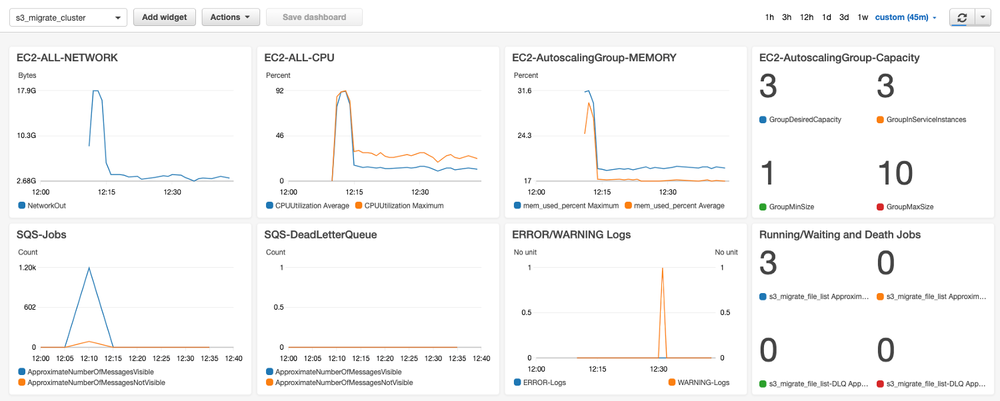

# Amazon S3 MultiThread Resume Migration Cluster Solution   

Amazon EC2 Autoscaling Cluster. Support mass scale of large objects trasmission between AWS Global S3 and China S3   
Cluster & Serverless Version 0.94  

  Cluster and Serverless Version Architecture:  
  
  
  
## Features 
* Transmit between Global and China S3: Cluster Version suitable of mass scale transmission, Serverless Version suitable for unpredictable burst transmission  
* **Fast and stable**: Multiple nodes X Multiple files/node X Multiple threads/file. Support mass of hugh file concurrently migration. Auto-seperate small file ( including 0 Size) and large file for different procedure. Enable TCP BBR acceleration.   
快速且稳定：多节点 X 单节点多文件 X 单文件多线程，支撑海量巨型文件并发传输。启用BBR加速。自动区分大小文件和 0 Size 文件走不同流程。  
* **Reliability**: SQS queue managed files level jobs, break-point resume trasmission, with timeout protection. Every part will be verified with MD5 after transmission. Single Point of True, final file merging takes the destination S3 as standard, to ensure integrity.  
* **Security**: Transfer in memory, no writing to disk. SSL encryption on transmission. Open source for audit. Leverage IAM role and SSM ParameterStore(KMS) to store credential Access Key.   
* **Controlable operation**: Job dispatched match the speed of transmission. System capacity predictable. DynamoDB and SQS read/write frequency only related to file numbers, no related to file size. Auto-collect logs to CloudWatch log group. AWS CDK auto deploy whole solution including Dashboard.  
* **Elastic cost optimization**: Cluster Autoscaling combined with EC2 Sport Instance to save cost. Serverless Lambda only pay to invocation; Support put objects to all kind of S3 storage class, to save long term storage cost.  
* Cluster version can work together with Lambda Serverless version, to support hybrid mode of traffic.  
  
## Guideline  
### Procedure  
0. Preparation(Optional): Jobsender fetch source and destination bucket list and compare delta to a Job List. And it can be run regularly.  

1. Jobsender sends Job messages to SQS, each job message on SQS is one file object on S3. And record job status on DDB for statistic.  
S3 Object created can also trigger SQS directly.  

2. EC2 or/and Lambda get Job message from SQS. Each EC2 instance can get multiple Job concurrently. 

3. EC2 or/and Lambda create multiple threads for each job, each thread transmit different part of the file object and upload to destination S3.

* EC2 and Lambda can work seperately and can work together to get different SQS Job, but notice the SQS timeout setting  

### 4 ways to start
* Job Sender get List from multiple S3 bucket and compare to destination

* New object created on S3 and trigger SQS message

* Bach jobs completed and start Job Sender to List compare buckets again.

* Cron event to trigger Job Sender to List bucket, compare and send new jobs.  

4 ways to start. Diagram:  
  

### Performance and Controlable operation  
  
* Single worker node concurrently multi-threads to get jobs from SQS, each job is one file level object on S3, and each job will be got by only one worker. Worker init multi-threads to concurrently transimit one job. This makes it high performance and controlable on file level, suitable for large scale of big files.  

* Server enabled TCP BBR acceleration, its performance accelerates 2.5 times than default Cubic mode  
* Autoscaling, multiple EC2 working together, performace overlay, distributed to different AZs.  
* Recommanded to deploy EC2 cluster to the same region as source S3and enable VPC S3 Endpoint  
* Record working status on DynamoDB for statistic. Transmit one file only need to write DynamoDB for 3-4 times.  
* Source/Destination bucket/prefix setting managed centrally on SSM ParaStore, no need to login to EC2 server for setting.  

#### Performance testing
  
In real test for large scale of GBytes level of files, single node setting with 25 or more threads (5 Files X 5 Threads) can reach 1Gbps traffic between Global and China Amazon S3. If they are most MBytes level files, you can setup more concurrency for one EC2 node.  

#### CDK Auto Deploy Dashboard  


### Reliability and Security  
* Each part transmission complete will take MD5 integrity verification on S3.  
* Multiple timeout interuption and retry protection, to ensure timeliness of single file delivery  
EC2 worker Job Timeout mechanism, on config.ini one hour by default  
SQS Message InvisibleTime setting to recover timeout message, redrive nodes to break-point resumable transmit. Recommand to set this according to EC2 worker JobTimeout. If Hybrid with Serverless, set timeout for the longer one InvisibleTime.  
SQS config Dead Letter Queue (DLQ), to ensure message reach maximum retries and send to DLQ for extra protection. Default 24 times in CDK deployed.   
* Single point of TRUE: take S3 as file parts management database, retransmit lost part while merging file.  
* After batch job completed, recommend to run Jobsender to compare.  
* Transmission parts only transfer via memory of worker, no writing to local disk for speed and security reason.  
* S3 API: SSL encrption
* Open source, auditable. Only import AWS SDK and Python3 internal libaray, no any other third party library.  
* One side access with IAM Role, the other side access with access key which keep in SSM ParaStore(KMS encrypted) or Lambda Env Var(KMS encrypted), no any credentials store in config or code file.  

### Elastic Cost   
* EC2 worker Autoscaling Group elastic scale up and down
* Spot Instances save cost
* EC2 jobsender&worker can work on one instance if needed
* Lambda Serverless can hybrid to handle unpredictable jobs
* Save object to S3 Standar, IA, Deep Archive and etc storage class

## Auto Deploy
### 1. Pre-config
* Before CDK deploy, please config SSM Parameter Store manually with this credentials  
Name: s3_migration_credentials  
Type: SecureString  
Tier: Standard
KMS key source：My current account/alias/aws/ssm  or others you can have  
This s3_migration_credentials is to access the account which is not the same as EC2 running account. s3_migration_credentials body example:  
```
{
  "aws_access_key_id": "your_aws_access_key_id",
  "aws_secret_access_key": "your_aws_secret_access_key",
  "region": "cn-northwest-1"
}
```
Configuration snapshot of s3_migration_credentials:   
  
* Edit app.py in CDK project as you needed S3 buckets information as example as below:  
```
[{
    "src_bucket": "your_global_bucket_1",
    "src_prefix": "your_prefix",
    "des_bucket": "your_china_bucket_1",
    "des_prefix": "prefix_1",
    }, {
    "src_bucket": "your_global_bucket_2",
    "src_prefix": "your_prefix",
    "des_bucket": "your_china_bucket_2",
    "des_prefix": "prefix_2",
    }]
```
These information will be deploy to Parameter Store as s3_migrate_bucket_para  
* Change your notification email in cdk_resource_stack.py
### 2. CDK Auto-deploy
* CDK will deploy below all resources except as manually config credentials in step 1.  
VPC ( with 2AZ, 2 Public subnets ) and S3 Endpoint,  
SQS Queue: s3_migrate_file_list  
SQS Queue DLQ: s3_migrate_file_list-DLQ,  
DynamoDB Table: s3_migrate_file_list,  
EC2 JobSender: t3.micro,  
EC2 Workers Autoscaling Group, instance type c5.large ( Can change it in cdk_ec2_stack.py )  
EC2 Autoscaling Policy  
SSM Parameter Store: s3_migrate_bucket_para as bucket information for Jobsender scan   
EC2 all needed IAM Role  
CloudWatch Dashboard monitor  
CloudWatch Alarm on Sqs queue empty and worker nodes more than one, alarm to scale down and send SNS notification  
  
* EC2 User Data will install CloudWatch Logs Agent to EC2 initial logs and s3_migrate application running logs to Log Group: s3_migration_log  
* EC2 User Data enable TCP BBR and auto start s3_migration_cluster_jobsender.py OR s3_migration_cluster_worker.py  
* EC2 User data auto clone application code and default config.ini from github and run it. Recommand to put code and modified config on your own S3 bucket for user data to pull or make your own AMI to start EC2.  
* If needed, you can change s3_migration_config.ini on EC2, as below description:  
```
* JobType = PUT or GET  
Determine Worker take its only IAM Role as access source or destination S3. PUT means Worker is not in the same account as the destination S3. And GET means Worker is not in the same account as the source S3.

* Des_bucket_default/Des_prefix_default
This is only for S3 trigger SQS senario, which has no Jobsender to give the destination S3 Buckeet/Prefix information.
This is useless for the senario that Jobsender scan buckets and send jobs to SQS.

* table_queue_name 
The SQS queue and DynamoDB Table name. Needs to be the same as config in  CloudFormation/CDK template table_queue_name

* ssm_parameter_bucket 
The name on SSM ParameterStore to save buckets information. Needed to be the same as CloudFormation/CDK ssm_parameter_bucket

* ssm_parameter_credentials 
The name on SSM ParameterStore to save access key of the other account
Needed to be the same as CloudFormation/CDK ssm_parameter_credentials

* StorageClass = STANDARD|REDUCED_REDUNDANCY|STANDARD_IA|ONEZONE_IA|INTELLIGENT_TIERING|GLACIER|DEEP_ARCHIVE
Select target S3 Storage Class

* ResumableThreshold
Unit MBytes, the file size equal or less than this value will not go through multipart upload procedue, no resumable upload to save performance.   

* MaxRetry
MaxRetry for single API call on application level

* MaxThread
Max thread concurrency for single file  

* MaxParallelFile
Max file transmission for a single noede  

* JobTimeout
Timeout for single file job, Unit Seconds  

* LoggingLevel = WARNING | INFO | DEBUG

* For Deubg: fVerifyMD5Twice, ChunkSize, CleanUnfinishedUpload, LocalProfileMode
* Hidden para: max_pool_connections=200 in s3_migration_lib.py
```
* Jobsender application starts and checks SQS queue is empty or not. If empty, it gets the bucket info from Parameter Store  s3_migrate_bucket_para, compare and send jobs to SQS queue.  
If not empty, means there is still jobs not finish on last cron, it will stop, and not new jobs created.  
* By default, Worker's Autoscaling Group desired EC2 count 1. You can change it.
* Lambda can be deploy seperatedly or consume the same SQS queue.  
----
* Notice: If you manually change the timeout, be notice to consider: SQS, EC2 JobTimeout and Lambda. By default, CDK deploy SQS message invisible time and EC2 JobTimeout as one hour.  

## Monitor  
* SQS queue Messages Available and Messages in Flight   
* SQS DLQ s3_migrate_file_list-DLQ, while message enter DLQ, it will trigger SNS to email alarm
* EC2 Network traffic, CPU, Memory and Instance count in Autoscaling group. The memory is collected by CloudWatch Agent.  
**Please enable "Group Metrics Collection" in EC2 console -> Autoscaling -> Monitor Tab by MANUALLY.**   
* Jobsender / Worker running logs collected by CloudWatch Logs, Log group: s3_migrate_log, ERROR/WARNING logs cound will emit to Dashboard   
* Autoscaling Up: CDK create SQS Messages Available Alarm, 5 mins higher than 100 will Autoscaling add EC2 instances  
* Autoscaling Shut Down: CDK create Expression metric: SQS Messages Available + Messages in Flight = 0 and EC2 count > 1. It will trigger Autoscaling down setting EC2 to 1. Or you can change it to 0 to save cost since there is no jobs. And will send SNS notification email. In this setting, it will only emit alarm for once, not going to disturb you in every 15 mins alarm.  
* The above monitoring will be created by CDK  
* DynamoDB Table to monitor detail of each jobs  

## Limitation 
* It doesn't support version control, but only get the lastest version of object from S3. Don't change the original file while copying.  

* Don't change the chunksize while start data copying.  

* It only compare the file Bucket/Key and Size. That means the same filename in the same folder and same size, will be taken as the same by jobsender or single node uploader.  

## License

This library is licensed under the MIT-0 License. See the LICENSE file.
