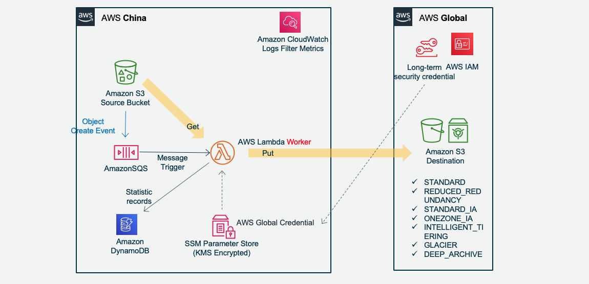
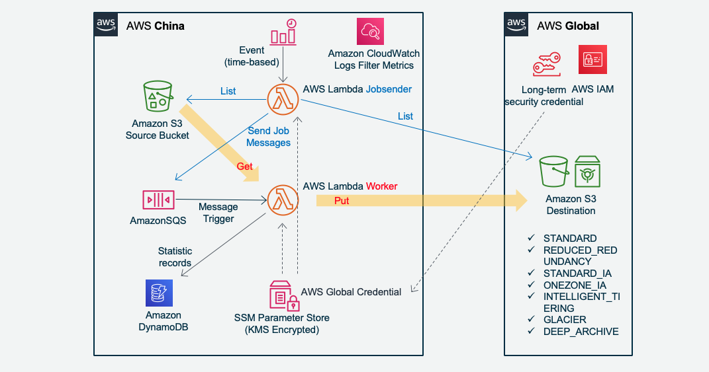

# Amazon S3 MultiThread Resume Migration Serverless Solution  (Amazon S3 多线程断点续传迁移无服务器方案)   
[Serverless Version ENGLISH README](./README-English.md)
  
Cluster & Serverless Version 0.98  
  
### 无服务器版本  
Amazon EC2 Autoscaling Group Cluster and Serverless AWS Lambda can be deployed together, or seperated used in different senario  
AmazonEC2自动扩展集群版本和无服务器Lambda版本，可以分别单独部署和运行在不同场景，也可以一起运行。  
* 海外和国内AmazonS3互传：无服务器版适合不定期突发传输。  
* 配合Amazon SQS超时时间，AWS Lambda 同样可以支撑单文件几十GB级别的对象，不用担心15分钟超时。  
* **快速且稳定**：多AWS Lambda并发 X 单个Lambda runtime并发多线程，支撑海量巨型文件并发传输。自动区分小文件(包括 0 Size 文件)和大文件，走不同流程。  
* 对于特殊区域，需要指定IP或必须启用BBR的场景，可以配置Lambda VPC模式，经NAT Instance访问互联网  
* **可靠**：Amazon SQS消息队列管理文件级任务，断点续传，超时中断保护。每个分片MD5完整性校验。Single Point of True，最终文件合并以S3上的分片为准，确保分片一致。  
* **安全**：内存转发不写盘，传输SSL加密，开源代码可审计，采用IAM Role和Lambda环境变量加密存储AcceesKey。  
* **可控运营**：任务派发与传输速度相匹配，系统容量可控可预期；Amazon DynamoDB和SQS读写次数只与文件数相关，而与文件大小基本无关；日志自动收集；  
* **弹性成本优化**：无服务器AWS Lambda只按调用时长*次数计费；支持直接存入S3各种存储级别，节省长期存储成本。
  
  无服务器版架构图如下：  
  Amazon S3 新增文件触发传输：
  
  
  Jobsender 扫描 Amazon S3 派发传输任务：
  
  CloudWatch Event 定时任务每小时触发一次 Jobsender 运行  
  

### 性能实测
* 美国Virginia AWS Lambda（不经NAT）1310个 文件（共50GB）文件大小从4M到1.3GB不等。 10分钟完成传输到中国宁夏Region。最高时153并发Lambda Runtime。文件成倍增大，传输时间并没有成倍增加。每个文件由一个Lambda并发独立处理，文件大，每个分片5MB，Lambda runtime 内就自动更多的Threads在并行传输。Lambda 内存配置 1GB，根据文件大小的情况，可以进一步调整缩小Lambda配置到最合适到性价比。

  

* 日本Tokyo: AWS Lambda（经VPC NAT Instance，NAT配置EIP地址和TCP BBR）单个80GB video文件，和单个45GB zip文件，分别 2 到 6 小时不等的时间传到中国宁夏region。是单文件由单并发Lambda Runtime处理。  

AWS Lambda 15分钟运行超时后，Amazon SQS消息InvisibleTime超时，消息恢复，重新触发一个Lambda runtime，从S3获取已上传分片列表，并继续传后续的分片。以下是log日志截图：  

  
1. AWS Lambda获取目标Amazon S3的 upload id列表，获得最后一次上传记录
2. 获取分片列表
3. 如出现网络中断，自动延迟重试
4. 获得目标Amazon S3上的已上传分片列表
5. 自动匹配分片号码
6. 下载剩下未上传的分片

### 自动部署监控 Dashboard  


## CDK 自动化部署  
请先安装 AWS CDK 然后由 CDK部署。CDK 文档可参照官网：  
https://docs.aws.amazon.com/cdk/latest/guide/getting_started.html   

### 1. 前置配置
* 请在 AWS CDK 部署前手工配置 System Manager Parameter Store 新增这个参数  
名称：s3_migration_credentials  
类型：SecureString  
级别：Standard  
KMS key source：My current account/alias/aws/ssm  或选择其他你已有的加密 KMS Key  
这个 s3_migration_credentials 是用于访问跟 AWS Lambda 不在一个账号系统下的那个S3桶的访问密钥，在目标Account 的IAM user配置获取。配置示例：  
```
{
  "aws_access_key_id": "your_aws_access_key_id",
  "aws_secret_access_key": "your_aws_secret_access_key",
  "region": "cn-northwest-1"
}
```
配置示意图：  
  
* 配置 AWS CDK 中 app.py 你需要传输的源S3桶/目标S3桶信息，示例如下：  
```
[{
    "src_bucket": "your_global_bucket_1",
    "src_prefix": "your_prefix",
    "des_bucket": "your_china_bucket_1",
    "des_prefix": "prefix_1"
    }, {
    "src_bucket": "your_global_bucket_2",
    "src_prefix": "your_prefix",
    "des_bucket": "your_china_bucket_2",
    "des_prefix": "prefix_2"
    }]
```
这些会被AWS CDK自动部署到 System Manager Parameter Store 的 s3_migration_bucket_para  

* 配置告警通知邮件地址在 app.py  
alarm_email = "alarm_your_email@email.com"

### 2. CDK自动部署
./cdk-serverless 该 CDK 由 Python 编写，会自动部署以下所有资源：  
* Option1: 新建了一个 Amazon S3 Bucket，这个Bucket所有新增的文件都会触发SQS，从而触发Lambda进行传输。  
如果你的 Bucket 是现有的，则可以手工配置这个Bucket触发SQS。
* Option2: 如果你没有权限配置现有的Bucket去触发SQS，例如别人的 Bucket 只开放了读权限给你，则本CDK部署 Lambda Jobsender 定时任务去扫描这些 Bucekt，并生成传输任务给 Lambda Worker 去执行。你只需要在 CDK 中的 app.py 配置对应的 Bucekts 信息即可。
* CDK 新建了 Amazon SQS Queue 队列和 一个相应的 SQS Queue DLQ 死信队列。InVisibleTime 15 分钟，有效期 14 天，重试 60 次后送 DLQ  
* 新建 Amazon DynamoDB 表  
* 上传 AWS Lambda 代码并配置函数相关参数，配置 AWS Lambda 的运行超时时间 15 分钟，内存 1GB，自动配置 AWS Lambda 访问 S3，SQS 和 DynamoDB 的 IAM 权限。Lambda 函数有两个：Jobsender 和 Worker。一个由CloudWatch Evnet 定时任务触发，负责根据Bucket信息扫描S3，生成任务发给SQS；一个是由SQS触发去传输S3上的对象。  
* AWS CDK 会新建一个 CloudWatch Dashboard: s3_migrate_serverless 监控 SQS 消息和 Lambda 运行状态
* 通过 AWS Lambda Log Group 创建了三个自定义 Log Filter，过滤出 Uploading, Downloading, Complete 的分片 Bytes，并统计为 Lambda 流量发布到 Dashboard。另外还创建了两个 Filter 监控日志出现 WARNING 或 ERROR。
* Ignore List: Jobsender 可以支持忽略某些文件，或者某类型文件 (通配符*或?)，不生成SQS任务。请在CDK目录的s3_migration_ignore_list.txt中配置。CDK部署的时候会将该列表上传到 SSM Parameter Store，你也可以后续在 parameter store 修改这个参数 s3_migrate_ignore_list。配置示例：
```
your_src_bucket/your_exact_key.mp4
your_src_bucket/your_exact_key.*
your_src_bucket/your_*
*.jpg
*/readme.md
```
  
### 手工配置说明  
如希望手工部署，则注意以下几点：
* 配置 Amazon SQS Access Policy，允许S3 bucket发布消息。修改以下json中account和bucket等信息：
```json
{
  "Version": "2012-10-17",
  "Id": "arn:aws:sqs:us-east-1:your_account:s3_migrate_file_list/SQSDefaultPolicy",
  "Statement": [
    {
      "Sid": "Sidx",
      "Effect": "Allow",
      "Principal": {
        "Service": "s3.amazonaws.com"
      },
      "Action": "SQS:SendMessage",
      "Resource": "arn:aws:sqs:us-east-1:your_account:s3_migrate_file_list",
      "Condition": {
        "ArnLike": {
          "aws:SourceArn": "arn:aws:s3:::source_bucket"
        }
      }
    }
  ]
}
```
* 对 AWS Lambda 的 log group 创建三个 Log filter，匹配 Pattern 如下:
```
Namespace: s3_migrate
Filter name: Downloading-bytes
Pattern: [info, date, sn, p="--->Downloading", bytes, key]
Value: $bytes
default value: 0
Filter name: Uploading-bytes
Pattern: [info, date, sn, p="--->Uploading", bytes, key]
Value: $bytes
default value: 0
Filter name: Complete-bytes
Pattern: [info, date, sn, p="--->Complete", bytes, key]
Value: $bytes
default value: 0
```
这样就把 AWS Lambda 的流量统计到了自定义 Metric s3_migrate，可以在 CloudWatch Metric 监控了。把监控配置为统计方式：Sum，周期 1 分钟。

## S3 版本控制支持
### 为什么要启用 S3 版本控制
如果不启用S3版本控制，在大文件正在传输的过程中，如果此时原文件被新的同名文件替换，会导致复制的文件部分是老的文件，部分是新的文件，从而破坏了文件的完整性。以前做法是强调不要在传输过程中去替换源文件，或者只允许新增文件。  
而对于无法避免会覆盖源文件的场景下，可以启用S3版本控制，则可以避免破坏文件完整性的情况。本项目已支持S3版本控制，需要配置：
* 对源文件的S3桶“启用版本控制”（Versioning）
* 源S3桶必须开放 ListBucketVersions, GetObjectVersion 这两个权限
* 以及设置以下的配置参数，分不同场景说明如下

### 支持S3 版本控制的配置参数 
* JobsenderCompareVersionId(True/False)：  
Jobsender 在对比S3桶的时候，对源桶获取对象列表时同时获取每个对象的 versionId，来跟目标桶比对。目标桶的 versionId 是在每个对象开始下载的时候保存在 DynamoDB 中。Jobsener 会从 DynamoDB 获取目标桶 versionId 列表。Jobsender发给SQS的Job会带上versionId。默认 Flase。  

* UpdateVersionId(True/False)：  
Worker 在开始下载源文件之前是否更新Job所记录的versionId。这功能主要是面向 Jobsender 并没有送 versionId 过来，但又需要启用 versionId 的场景。默认 Flase。  

* GetObjectWithVersionId(True/False)：  
Worker 在获取源文件的时候，是否带 versionId 去获取。如果不带 versionId 则获取当前最新文件。  
默认 Flase。  
  
对于Cluster版本，以上参数都在配置文件 s3_migration_config.ini 
对于Serverless版本，以上参数分别在 Lambda jobsender 和 worker 的环境变量中

### 场景
* S3新增文件触发的SQS Jobs：  
```
  UpdateVersionId = False  
  GetObjectWithVersionId = True   
```
  S3新增文件直接触发SQS的情况下，S3启用了版本控制功能，那么SQS消息里面是带 versionId 的，Worker 以这个versionId 去 GetObject。如果出现中断，恢复时仍以该 versionId 去再次获取。
  如果你没有GetObjectVersion权限，则需要把这两个开关设False，否则会因为没权限而获取文件失败 (AccessDenied)。  

* Jobsender比对S3发送SQS Jobs这里又分两种目的：  
  
  1. 完整性：为了绝对保证文件复制过程中，即使被同名文件覆盖，也不至于文件半新半旧。  
  ```
  JobsenderCompareVersionId = False  
  UpdateVersionId = True  
  GetObjectWithVersionId = True  
  ```
  为了比对速度更快，所以在比对的时候不获取versionId，这样发送SQS的 versionId 是 'null'
  在 Get object 之前获取真实 versionId，并写入 DynamoDB，完成传输之后对比DDB记录的 versionId 。在文件传输结束时，再次校验 DynamoDB 中保存的 versionId，如果因为发生中断重启，而刚好文件被替换，此时versionId会不一致，程序会重新执行传输。

  2. 完整性和一致性：为了对比现存源和目的S3的文件不仅仅Size一致，版本也要一致性。并绝对保证文件复制过程中，即使被同名文件覆盖，也不至于文件半新半旧。
    ```  
    JobsenderCompareVersionId = True  
    UpdateVersionId = False  
    GetObjectWithVersionId = True  
    ```
    Jobsender会比对 versionId，并且发送SQS带真实 versionId。此时已经有真实的 versionId了，就没必要启用worker UpdateVersionId了，节省时间和请求数。
      
* 对于觉得没必要比对文件 version，文件传输过程中也不会被替换，或者没有源S3的 GetObjectVersion 权限，则三个开关都设置False即可（默认情况）

### 为什么不默认就把所有开关全部打开
* 速度问题：获取源S3 List VersionId 列表，会比只获取 Object 列表慢的多，如果文件很多（例如1万条记录以上），又是 Lambda 做 Jobsender 则可能会超过15分钟限制。

* 权限问题：不是所有桶都会开放 GetObjectVersion 权限。例如某些 OpenDataSet 即使打开了 Versioning 功能，但却没有开放 GetObjectVersion 权限。


## 局限和提醒注意：
* 所需内存 = 并发数 * ChunckSize 。小于50GB的文件，ChunckSize为5MB，大于50GB的文件，则ChunkSize会自动调整为约等于: 文件Size/10000。  
例如如果平均要处理的文件 Size 是 500GB ，ChunckSize 会自动调整为50MB，并发设置是 5 File x 10 Concurrency/File = 50，所以需要的EC2或Lambda的可运行内存约为 50 x 50MB = 2.5GB。 
如需要提高并发度，可以调整配置，但对应的EC2或Lambda内存也要相应增加。 

* 不要在开始数据复制之后修改Chunksize。    

* Jobsender 只对比文件 Bucket/Key 和 Size。即相同的目录下的相同文件名，而且文件大小是一样的，则会被认为是相同文件，jobsender或者单机版都会跳过这样的相同文件。如果是S3新增文件触发的复制，则不做文件是否一样的判断，直接复制。  

* 删除资源则 cdk destroy 。  
另外 DynamoDB、CloudWatch Log Group 、自动新建的 S3 bucket 需要手工删除   


## License

This library is licensed under the MIT-0 License. See the LICENSE file.
