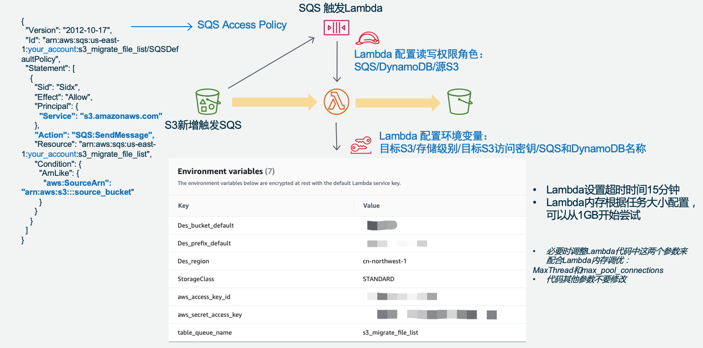
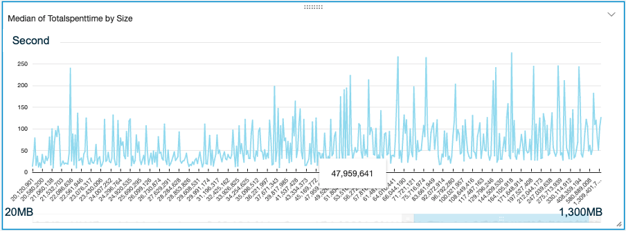
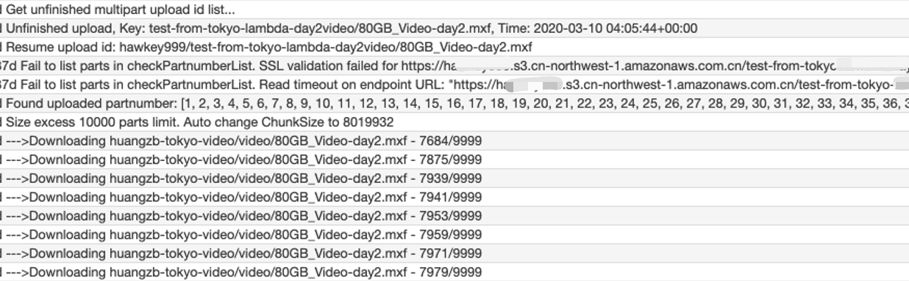
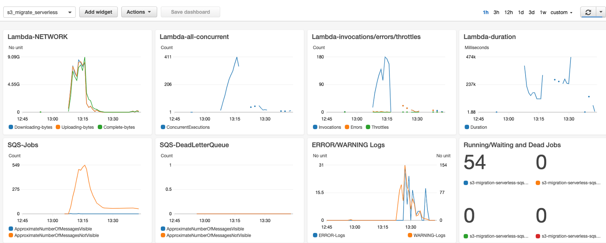

# Amazon S3 MultiThread Resume Migration Serverless Solution  (Amazon S3 多线程断点续传迁移无服务器方案)   
[Serverless Version ENGLISH README](./README-English.md)
  
Cluster & Serverless Version 0.94  
  
### 无服务器版本  
Amazon EC2 Autoscaling Group Cluster and Serverless AWS Lambda can be deployed together, or seperated used in different senario  
AmazonEC2自动扩展集群版本和无服务器Lambda版本，可以分别单独部署和运行在不同场景，也可以一起运行。  
* 海外和国内AmazonS3互传：无服务器版适合不定期突发传输。  
* 配合Amazon SQS超时时间，AWS Lambda 同样可以支撑单文件几十GB级别的对象，不用担心15分钟超时。  
* **快速且稳定**：多AWS Lambda并发 X 单个Lambda runtime并发多线程，支撑海量巨型文件并发传输。自动区分小文件(包括 0 Size 文件)和大文件，走不同流程。  
* 对于特殊区域，需要指定IP或必须启用BBR的场景，可以配置Lambda VPC模式，经NAT Instance访问互联网  
* **可靠**：Amazon SQS消息队列管理文件级任务，断点续传，超时中断保护。每个分片MD5完整性校验。Single Point of True，最终文件合并以S3上的分片为准，确保分片一致。  
* **安全**：内存转发不写盘，传输SSL加密，开源代码可审计，采用IAM Role和Lambda环境变量加密存储AcceesKey。  
* **可控运营**：任务派发与传输速度相匹配，系统容量可控可预期；Amazon DynamoDB和SQS读写次数只与文件数相关，而与文件大小基本无关；日志自动收集；  
* **弹性成本优化**：无服务器AWS Lambda只按调用时长*次数计费；支持直接存入S3各种存储级别，节省长期存储成本。
  
  无服务器版架构图如下：  
  
  

### 性能实测
* 美国Virginia AWS Lambda（不经NAT）1310个 文件（共50GB）文件大小从4M到1.3GB不等。 10分钟完成传输到中国宁夏Region。最高时153并发Lambda Runtime。文件成倍增大，传输时间并没有成倍增加。每个文件由一个Lambda并发独立处理，文件大，每个分片5MB，Lambda runtime 内就自动更多的Threads在并行传输。Lambda 内存配置 1GB，根据文件大小的情况，可以进一步调整缩小Lambda配置到最合适到性价比。

  

* 日本Tokyo: AWS Lambda（经VPC NAT Instance，NAT配置EIP地址和TCP BBR）单个80GB video文件，和单个45GB zip文件，分别 2 到 6 小时不等的时间传到中国宁夏region。是单文件由单并发Lambda Runtime处理。  

AWS Lambda 15分钟运行超时后，Amazon SQS消息InvisibleTime超时，消息恢复，重新触发一个Lambda runtime，从S3获取已上传分片列表，并继续传后续的分片。以下是log日志截图：  

  
1. AWS Lambda获取目标Amazon S3的 upload id列表，获得最后一次上传记录
2. 获取分片列表
3. 如出现网络中断，自动延迟重试
4. 获得目标Amazon S3上的已上传分片列表
5. 自动匹配分片号码
6. 下载剩下未上传的分片

### 自动部署监控 Dashboard  


### CDK 自动化部署
请先安装 AWS CDK 然后按以下命令部署，CDK安装部署可参照官网：  
https://docs.aws.amazon.com/cdk/latest/guide/getting_started.html   

```bash
cd cdk-serverless
cdk deploy
```
该 CDK 由 Python 编写，会自动部署以下资源：  
* 新建 Amazon S3 Bucket  
* 新建 Amazon SQS Queue 队列和 一个相应的 SQS Queue DLQ 死信队列。InVisibleTime 15 分钟，有效期 14 天，重试 100 次后送 DLQ  
* 新建 Amazon DynamoDB 表  
* 上传 AWS Lambda 代码并配置函数相关参数，请在部署前修改 CDK 模版中 app.py 文件，或者等部署完之后在Lambda环境变量中修改  
```
Des_bucket_default = 'your_des_bucket'
Des_prefix_default = 'my_prefix'
StorageClass = 'STANDARD'
aws_access_key_id = 'xxxxxxxxx'
aws_secret_access_key = 'xxxxxxxxxxxxxxx'
aws_access_key_region = 'cn-northwest-1'
table_queue_name 会由 CDK 自动生成  
```
* 配置 AWS Lambda 的运行超时时间 15 分钟，内存 1GB  
* 自动配置 AWS Lambda 访问 S3，SQS 和 DynamoDB 的 IAM 权限。  
* 注意：推荐不在 AWS CDK 中配置 Lambda 的环境变量，而是在 Lambda 部署完成后在 Lambda 中配置，特别是aws_access_key_id 和 aws_secret_access_key，这样可以避免写 Access Key 到你的 CDK 文件中引发无意中泄漏。但缺点是，再次用 CDK 部署新版本的 Lambda 函数的话，环境变量会被覆盖为 CDK 中的配置参数。  
* 注意：AWS CDK 不支持用现有的 S3 Bucket 来配置触发，只能让 CDK 新建。所以如果你要使用现有的 S3，则需要手工配置这个 Bucket 触发SQS，其他可以继续用 CDK 部署。  
* AWS CDK 会新建一个 CloudWatch Dashboard: s3_migrate_serverless 监控 SQS 消息和 Lambda 运行状态
* 通过 AWS Lambda Log Group 创建了三个自定义 Log Filter，过滤出 Uploading, Downloading, Complete 的分片 Bytes，并统计为 Lambda 流量发布到 Dashboard
* 创建一个 Alarm ，检测到 Amazon SQS queue 空了，即没有 Visible 也没有 InVisible 消息，则发出 SNS 告警到订阅的邮件地址，告知任务全部完成了。邮件地址请在 CDK 的 app.py 文件中定义，或到 SNS 中修改。
  
### 手工配置说明  
如不希望用 AWS CDK 部署可以参照以下手工部署步骤：
* 配置 Amazon SQS 消息队列，以及对应的死信队列DLQ。策略为消息有效期14天，15分钟超时，重试100次转入DLQ。
* 配置 Amazon SQS Access Policy，允许S3 bucket发布消息。修改以下json中account和bucket等信息：
```json
{
  "Version": "2012-10-17",
  "Id": "arn:aws:sqs:us-east-1:your_account:s3_migrate_file_list/SQSDefaultPolicy",
  "Statement": [
    {
      "Sid": "Sidx",
      "Effect": "Allow",
      "Principal": {
        "Service": "s3.amazonaws.com"
      },
      "Action": "SQS:SendMessage",
      "Resource": "arn:aws:sqs:us-east-1:your_account:s3_migrate_file_list",
      "Condition": {
        "ArnLike": {
          "aws:SourceArn": "arn:aws:s3:::source_bucket"
        }
      }
    }
  ]
}
```
* 配置 Amazon S3 Event触发SQS  
* 配置 AWS Lambda 的访问角色权限为：  
访问读写对应的Amazon SQS和DynamoDB  
读源 Amazon S3 Bucket权限  
写Amazon CloudWatch Logs  
* 配置 AWS Lambda 为 Python 3.8 ，并部署这两个代码文件，位于  
```
amazon-s3-resumable-upload/serverless/cdk-serverless/lambda/  
lambda_function.py  
s3_migration_lib.py  
```
* 配置 AWS Lambda 环境变量，目标S3/存储级别/目标S3访问密钥/SQS和DynamoDB名称：
```
Des_bucket_default  
Des_prefix_default  
```
是给S3新增文件触发SQS的场景，用来配置目标桶/前缀的。
对于Jobsender扫描S3并派发Job的场景，这两项配置任意字符即可。程序看到SQS消息里面有就会使用消息里面的目标桶/前缀
```
StorageClass  
```
选择目标存储的存储类型
STANDARD|REDUCED_REDUNDANCY|STANDARD_IA|ONEZONE_IA|INTELLIGENT_TIERING|GLACIER|DEEP_ARCHIVE
```
aws_access_key_id  
aws_secret_access_key  
aws_access_key_region
```
用于访问跟 Lambda 不在一个账号系统下的那个S3桶的访问密钥，在目标Account 的IAM user配置获取。
aws_access_key_region 代码, 例如 cn-north-1
```
table_queue_name  
```
访问的Amazon DynamoDB的表名，需与Amazon CloudFormation/CDK创建的ddb名称一致  


* AWS Lambda 设置超时时间15分钟，内存可以调整，可以从1GB开始尝试。
必要时调整AWS Lambda代码中这两个参数来配合Lambda内存调优：MaxThread和max_pool_connections。代码其他参数不要修改。

* 配置 AWS Lambda 被SQS触发，一次取一条消息  

* 对 AWS Lambda 的 log group 创建三个 Log filter，匹配 Pattern 如下:
```
Namespace: s3_migrate
Filter name: Downloading-bytes
Pattern: [info, date, sn, p="--->Downloading", bytes, key]
Value: $bytes
default value: 0
Filter name: Uploading-bytes
Pattern: [info, date, sn, p="--->Uploading", bytes, key]
Value: $bytes
default value: 0
Filter name: Complete-bytes
Pattern: [info, date, sn, p="--->Complete", bytes, key]
Value: $bytes
default value: 0
```
这样就把 AWS Lambda 的流量统计到了自定义 Metric s3_migrate，可以在 CloudWatch Metric 监控了。把监控配置为统计方式：Sum，周期 1 分钟。

* 配置 Amazon SQS 监控告警，把 Visible 和 InVisible 消息相加，如果连续 3 of 3 为 <= 0 则发 SNS 告警通知。


## Limitation 局限
* 本项目不支持Amazon S3版本控制，相同对象的不同版本是只访问对象的最新版本，而忽略掉版本ID。即如果启用了版本控制，也只会读取S3相同对象的最后版本。目前实现方式不对版本做检测，也就是说如果传输一个文件的过程中，源文件更新了，会到导致最终文件出错。解决方法是在完成批次迁移之后再运行一次Jobsender，比对源文件和目标文件的Size不一致则会启动任务重新传输。但如果Size一致的情况，目前不能识别。  

* 不要在开始数据复制之后修改Chunksize。  

## License

This library is licensed under the MIT-0 License. See the LICENSE file.
