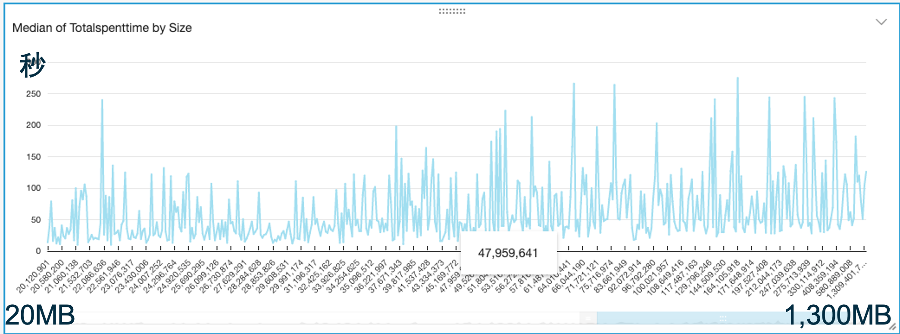

# Amazon S3 MultiThread Resume Migration Solution  (Amazon S3多线程断点续传迁移)   

### 无服务器版本  
Amazon EC2 Autoscaling Group Cluster and Serverless AWS Lambda can be deployed together, or seperated used in different senario  
EC2自动扩展集群版本和无服务器Lambda版本，可以分别单独部署和运行在不同场景，也可以一起运行。  
* 海外和国内S3互传：无服务器版适合不定期突发传输。  
* 配合SQS超时时间，Lambda 同样可以支撑单文件几十GB级别的对象，不用担心15分钟超时。  
* 快速且稳定：多Lambda并发 X 单个Lambda runtime并发多线程，支撑海量巨型文件并发传输。  
* 对于特殊区域，需要指定IP或必须启用BBR的场景，可以配置Lambda VPC模式，经NAT Instance访问互联网  
* 可靠：SQS消息队列管理文件级任务，断点续传，超时中断保护。每个分片MD5完整性校验。Single Point of True，最终文件合并以S3上的分片为准，确保分片一致。  
* 安全：内存转发不写盘，传输SSL加密，开源代码可审计，采用IAM Role和Lambda环境变量加密存储AcceesKey。  
* 可控运营：任务派发与传输速度相匹配，系统容量可控可预期；DynamoDB和SQS读写次数只与文件数相关，而与文件大小基本无关；日志自动收集；  
* 弹性成本优化：无服务器Lambda只按调用次数计费；支持直接存入S3各种存储级别，节省长期存储成本。
  
  无服务器版架构图如下：  
  
  

### 性能实测
* 美国Virginia Lambda（不经NAT）1310个 文件（共50GB）文件大小从4M到1.3GB不等。 10分钟完成传输到中国宁夏Region。最高时153并发Lambda Runtime。文件成倍增大，传输时间并没有成倍增加。每个文件由一个Lambda并发独立处理，文件大，每个分片5MB，Lambda runtime 内就自动更多的Threads在并行传输。Lambda 内存配置 1GB，根据文件大小的情况，可以进一步调整缩小Lambda配置到最合适到性价比。

  

* 日本Tokyo: Lambda（经VPC NAT Instance，NAT配置EIP地址和TCP BBR）单个80GB video文件，和单个45GB zip文件，分别 2 到 6 小时不等的时间传到中国宁夏region。是单文件由单并发Lambda Runtime处理。  

Lambda 15分钟运行超时后，SQS消息InvisibleTime超时，消息恢复，重新触发一个Lambda runtime，从S3获取已上传分片列表，并继续传后续的分片。以下是log日志截图：  

  
1. Lambda获取目标S3的 upload id列表，获得最后一次上次记录
2. 获取分片列表
3. 如出现网络中断，自动延迟重试
4. 获得目标S3上的已上传分片列表
5. 自动匹配分片号码
6. 下载剩下未上传的分片

### 配置说明
* 配置 SQS 消息队列，以及对应的死信队列DLQ。策略为消息有效期14天，15分钟超时，重试100次转入DLQ。
* 配置 SQS Access Policy，允许S3 bucket发布消息。修改以下json中account和bucket等信息：
```json
{
  "Version": "2012-10-17",
  "Id": "arn:aws:sqs:us-east-1:your_account:s3_migrate_file_list/SQSDefaultPolicy",
  "Statement": [
    {
      "Sid": "Sidx",
      "Effect": "Allow",
      "Principal": {
        "Service": "s3.amazonaws.com"
      },
      "Action": "SQS:SendMessage",
      "Resource": "arn:aws:sqs:us-east-1:your_account:s3_migrate_file_list",
      "Condition": {
        "ArnLike": {
          "aws:SourceArn": "arn:aws:s3:::source_bucket"
        }
      }
    }
  ]
}
```
* 配置 S3 Event触发SQS  
* 配置 Lambda 的访问角色权限为：  
访问读写对应的SQS和DynamoDB  
读源S3 Bucket权限  
写CloudWatch Logs  
* 配置 Lambda 为 Python 3.8 ，并部署这两个代码文件：
lambda_function.py  
s3_migration_lib.py  
* 配置 Lambda 环境变量，目标S3/存储级别/目标S3访问密钥/SQS和DynamoDB名称：
```
Des_bucket_default  
Des_prefix_default  
是给S3新增文件触发SQS的场景，用来配置目标桶/前缀的。
对于Jobsender扫描S3并派发Job的场景，这两项配置任意字符即可。程序看到SQS消息里面有就会使用消息里面的目标桶/前缀

Des_region  
目标region代码，如cn-north-1

StorageClass  
选择目标存储的存储类型
STANDARD|REDUCED_REDUNDANCY|STANDARD_IA|ONEZONE_IA|INTELLIGENT_TIERING|GLACIER|DEEP_ARCHIVE

aws_access_key_id  
aws_secret_access_key  
用于访问跟 Lambda 不在一个账号系统下的那个S3桶的访问密钥，在目标Account 的IAM user配置获取。

table_queue_name  
访问的SQS和DynamoDB的表名，需与CloudFormation/CDK创建的ddb/sqs名称一致  
```

* Lambda 设置超时时间15分钟，内存可以调整，可以从1GB开始尝试。
必要时调整Lambda代码中这两个参数来配合Lambda内存调优：MaxThread和max_pool_connections。代码其他参数不要修改。


## License

This library is licensed under the MIT-0 License. See the LICENSE file.
