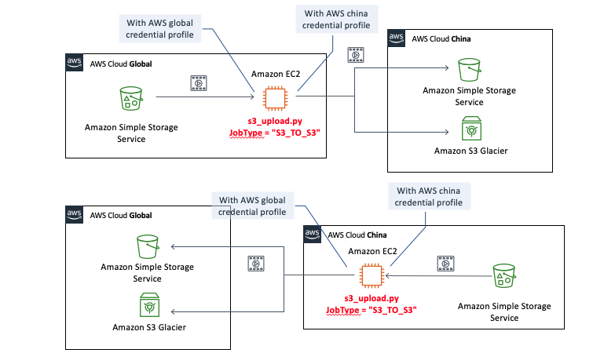
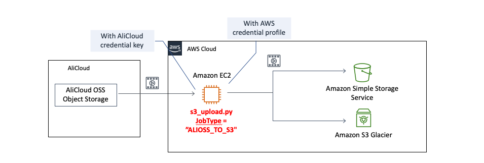
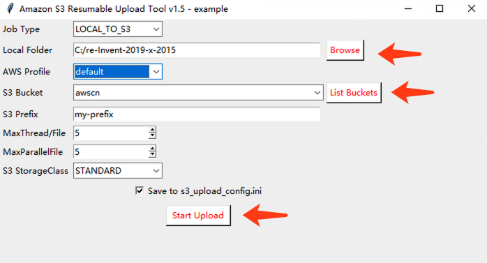
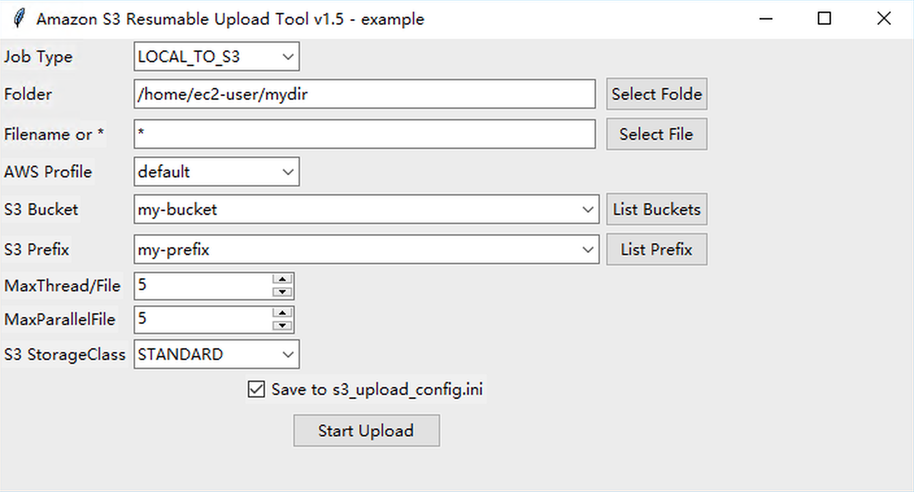

# Amazon S3 MultiThread Resume Upload Tool - Single Node (Amazon S3多线程断点续传 - 单机版)   

Muliti-thread Amazon S3 upload tool, breaking-point resume supported, suitable for large files  
多线程断点续传到 Amazon S3，适合批量的大文件  

Upload from local disk, copy files between Global AWS and China AWS S3, or migrate from AliCloud OSS to Amazon S3  
从本地硬盘上传，或海外与中国区 Amazon S3 之间互相拷贝，或从阿里云 OSS 迁移到 Amazon S3。  

### Features:  
具体功能包括：  

* Split multipart and get from source, multi-thread upload to S3 and merge, support resume upload (Part level).   
源文件的自动分片获取，多线程并发上传到目的S3再合并文件，断点续传(分片级别)。  

* Support source: local files, Amazon S3, AliCloud OSS  
支持的源：本地文件、Amazon S3、阿里云 OSS  

* Support destination: Amazon S3  
支持的目的地：Amazon S3  

* Multi-files concurrently transmission and each file multi-threads download and upload.    
多文件并发传输，且每个文件再多线程并发传输，充分压榨带宽。S3_TO_S3 或 ALIOSS_TO_S3 中间只过中转服务器的内存，不落盘，节省时间和存储。  

* Auto-retry, progressive increase put off, auto-resume upload parts, MD5 verification on S3  
网络超时自动多次重传。重试采用递增延迟，延迟间隔=次数*5秒。程序中断重启后自动查询S3上已有分片，断点续传(分片级别)。每个分片上传都在S3端进行MD5校验，每个文件上传完进行分片合并时可选再进行一次S3的MD5与本地进行二次校验，保证可靠传输。  

* Auto iterate subfolders, and can also specify only one file.  
自动遍历下级子目录，也可以指定单一文件拷贝。  

* Support setup S3 storage class, such as: standard, S3-IA, Glacier or Deep Archive  
可设置S3存储级别，如：标准、S3-IA、Glacier或深度归档。  

* Can setup ouput info level  
可设置输出消息级别，如设置WARNING级别，则只输出你最关注的信息。
--------  

### Version 1.61
* Support GUI for LOCAL_TO_S3 mode
* Package binary version to Windows with GUI, no local python needed
* Performance upgrade for small size file and support 0 size file for all mode.
* Support windows Chinese character folder

## Architecture 架构图  
1. Local upload to S3  

2. Between AWS Global S3 and China S3  

3. From AliCloud OSS to S3  

  
## Installation  安装  
#  
**This tool runs under Python3, if you can't install python3, and are WINDOWS SYSTEM, you can run package version and skip the section of Install Python3 &  SDK part.**   
  
**本工具在Python3运行，如果不方便安装Python，并且是 Windows 系统，可以直接使用以下打包版本，并跳过 Install Python3 & SDK 说明小节。**  

[Win64 Package with GUI **s3_upload.zip** No python installation needed](./win64/s3_upload.zip)  
Download and unzip the s3_upload.zip then run **s3_upload.exe** , no python needed   
#

### Install Python3 & SDK 
1. Install [Python](https://www.python.org/downloads/) 3.6 or above  
  

2. Install SDK  
Install aws python sdk boto3. If you need to copy from AliCloud OSS, you need to install oss2 package as well.   
该工具需要先安装 AWS SDK [boto3](https://github.com/boto/boto3)，如果需要从阿里云OSS拷贝，则还需要安装阿里 SDK [oss2](https://github.com/aliyun/aliyun-oss-python-sdk)。  
```bash
    pip install -r requirements.txt --user
```

### Setup Credential  

1. AWS Credential  
You need to make sure the credentials you're using have the correct permissions to access the Amazon S3
service. If you run into 'Access Denied' errors while running this sample, please follow the steps below.  
确认你的 IAM user 有权限访问对应的S3.  

* Log into the [AWS IAM Console](https://console.aws.amazon.com/iam/home) Navigate to the Users page. Find the AWS IAM user whose credentials you're using. Under the 'Permissions' section, attach the policy called 'AmazonS3FullAccess'
* Copy aws_access_key_id and aws_secret_access_key of this user for below setting
* Create file `"credentials"` in ~/.aws/ (`C:\Users\USER_NAME\.aws\` for Windows users) and save below content:  
创建文件名为 `"credentials"` 于 ~/.aws/ 目录(`C:\Users\USER_NAME\.aws\` for Windows users) 并保存以下内容:
```
[default]
region = <your region>
aws_access_key_id = <your access key id>
aws_secret_access_key = <your secret key>
```
* If S3_TO_S3 mode, you need two profile for source and destination S3  
如果是S3 copy to S3你需要配置两个 profile，以便访问源和目的S3  
See the [AWS document Security Credentials](http://aws.amazon.com/security-credentials) page for more detail  
For example：
```
[beijing]
region=cn-north-1
aws_access_key_id=XXXXXXXXXXXXXXX
aws_secret_access_key=XXXXXXXXXXXXXXXXXXXXXX

[oregon]
region=us-west-2
aws_access_key_id=XXXXXXXXXXXXXXX
aws_secret_access_key=XXXXXXXXXXXXXXXXXXXXXX
```

2. If ALIOSS_TO_S3 mode, setup AliCloud credentials in s3_upload_config.ini  
```
ali_SrcBucket = "your bucket name"  # 阿里云OSS 源Bucket，对于 LOCAL_TO_S3/S3_TO_S3 则本字段无效
ali_access_key_id = "xxxxxxxxxxx"  # 阿里云 RAM 用户访问密钥
ali_access_key_secret = "xxxxxxxxxxxx"
ali_endpoint = "oss-cn-beijing.aliyuncs.com"  # OSS 区域 endpoint，在OSS控制台界面可以找到
```

## Application Configure - 应用配置
**For local upload to S3, you can run with GUI and config on GUI**  
**如果是本地上传，运行图形界面模式，你可以直接在界面做这些应用设置**  
### Config `s3_upload_config.ini`
* 上面配置的 profile name 填入对应源和目的 profile name 项，例如：  
```
SrcProfileName = beijing
DesProfileName = oregon
```
* Setup Job Type  
'LOCAL_TO_S3' or 'S3_TO_S3' or 'ALIOSS_TO_S3'   
```
JobType = LOCAL_TO_S3
```
* Setup folder, destination buckets and other optional config  
设置源文件路径和上传S3，以及其他可选配置  

## Start the app - 运行应用
* Python3 Environment and don't want to run with GUI, Linux/MacOS/Win  
Python3 环境，且不需要GUI界面，运行在 Linux/MacOS/Win
```bash
python3 s3_upload.py --nogui
```

* Python3 Environment and run with GUI. Linux/MacOS/Win  
Python3 环境，且带GUI界面，运行在 Linux/MacOS/Win：
```bash
python3 s3_upload.py --gui
```

部分 MacOS 版本的 Python 运行 GUI（ tkinter ）会出现 Mac WindowServer 端口冲突，导致 Mac 退出用户重新启动的情况。目前受限于 Python tkinter 与 MacOS，遇到这种情况，需要升级或降级 Python/tkinter 解决。参考：  
https://bugs.python.org/issue37833  
https://stackoverflow.com/questions/57400301/how-to-fix-tkinter-every-code-with-gui-crashes-mac-os-with-respring    
或不带 GUI 来运行 python3 s3_upload.py --nogui。Windows 操作系统没有反馈有该问题。  
  
* Windows non-Python Environment, and to run LOCAL_TO_S3 job, Run s3_upload.exe  
Windows 非 Python 环境运行本地上传任务，运行 s3_upload.exe  




### Known Issue  注意:  

* While same file prefix/name with same size, it will be considered as duplicated file and this file will be ignore.
This is a trade-off for performance. It might be improved in the coming release, with Verification Option.  
相同的文件前缀和文件名，并且文件大小相同的，则会被认为是重复文件不再传输。  

* Amazon S3 only support 10,000 parts for one single file. Now the application can auto tuning Chunksize for big file, you don't need to change it manually.  
If you need to change ChunkSize when files are transmitting, please stop application and restart, then select "CLEAN unfinished upload". Application will clean and re-upload all unfinished files.   
由于 Amazon S3 API 最大只支持单文件10,000个分片。目前程序已经有自动调整 ChunkSize 机制，无需人工干预。  
如果某个文件传输到一半，要修改 ChunkSize 的话。请中断，然后在启动时选择CLEAN unfinished upload，程序会清除未完成文件，并重新上传整个文件，否则文件断点会不正确。  

* S3_TO_S3 Senario, there is only one Prefix in config, source and destination S3 bucekt are the same prefix. If you need more flexible prefix setting, please use s3_migrate Cluster version.  
S3_TO_S3 场景，配置中只做了一个 Prefix 设置项，源和目的S3 Bucket都是相同的 Prefix。如果需要更灵活的设置，请使用s3_migrate集群版本.   

* It doesn't support version control, but only get the lastest version of object from S3. Don't change the original file while copying.  
本项目不支持S3版本控制，相同对象的不同版本是只访问对象的最新版本，而忽略掉版本ID。即如果启用了版本控制，也只会读取S3相同对象的最后版本。目前实现方式不对版本做检测，也就是说如果传输一个文件的过程中，源文件更新了，会到导致最终文件出错。  

## TCP BBR improve Network performance - 提高网络性能
If copy cross AWS Global and China, recommend to enable TCP BBR: Congestion-Based Congestion Control, which can improve performance.   
如果是跨 AWS Global 和中国区，推荐启用 TCP BBR: Congestion-Based Congestion Control，可以提高传输效率  

[Amazon Linux AMI 2017.09.1 Kernel 4.9.51](https://aws.amazon.com/cn/amazon-linux-ami/2017.09-release-notes/) or later version supported TCP Bottleneck Bandwidth and RTT (BBR) .  

BBR is `NOT` enabled by default. You can enable it on your EC2 Instance via:：
```
$ sudo modprobe tcp_bbr
$ sudo modprobe sch_fq
$ sudo sysctl -w net.ipv4.tcp_congestion_control=bbr
```
Persistent configuration should look like:
```
$ sudo su -

# cat <<EOF>> /etc/sysconfig/modules/tcpcong.modules
>#!/bin/bash
> exec /sbin/modprobe tcp_bbr >/dev/null 2>&1
> exec /sbin/modprobe sch_fq >/dev/null 2>&1
> EOF

# chmod 755 /etc/sysconfig/modules/tcpcong.modules

# echo "net.ipv4.tcp_congestion_control = bbr" >> /etc/sysctl.d/00-tcpcong.conf
```
## License

This library is licensed under the MIT-0 License. See the LICENSE file.
